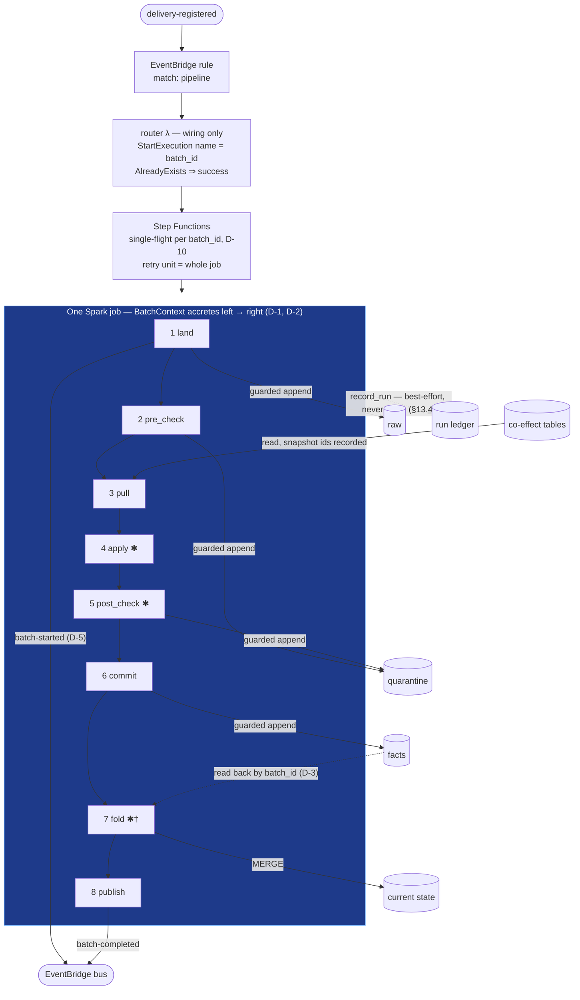

# Runner Spine
## From `delivery-registered` to `batch-completed` — Architecture Description (Target)

**Status:** Draft v1.1 (editorial revision of v1.0 — decisions unchanged) · **Parent:** *001 Batch Data Processing Architecture* (§3.5, §5) · **Plan:** 003 §3.1 · **Position:** consumes `delivery-registered` (002.1 §6.4); owns the stage sequence `land → publish` · **Pattern:** context-enriching flow over one Spark job; pure core, effects at the edge

> **Conventions.** Positions are recorded as decisions **D-1…D-13** in Y-statement form (*in the context of… facing… we chose… and rejected… to achieve… accepting…*) so 005–008 can cite both the choice and its cost; all are settled as of v1.0. Every section after the decision record opens with the problem it answers. Detail that belongs to a stage-cluster doc is named and deferred, not sketched here. v1 means *reviewed and binding*, not final — friction from drafting 005–008 lands as v1.x revisions with decision-record updates (003 §3).

---

## 1. Context — Closing the Open Seam

**The problem.** Ingestion ends at `delivery-registered`: a durable raw delivery, a minted `batch_id`, and an event nobody consumes (003 §0). Everything downstream of that event — eight stages, from landing raw rows to announcing a completed batch — is unbuilt, and docs 005–008 cannot describe those stages precisely until something defines what a stage *is*, what it receives, and what it may do. This document is that something.

The spine is the consumer of `delivery-registered`. An EventBridge rule routes on the event's `pipeline` field to a Step Functions execution, which runs **one Spark job** executing all eight stages for that batch. The stages are not services. They are **functions sharing one execution context** (001 §3.5) — their seams are data contracts, not deployment boundaries. This document defines the two contracts everything else writes against: the **context** (what each stage receives and adds, §5) and the **stage protocol** (how framework stages and pipeline-pure stages plug into one sequence, §6). Docs 005–008 fill in stage behavior; they may not alter these contracts.

### 1.1 The shape at a glance



**Legend.** ✱ = pure pipeline code (`apply`, `post_check`, optional `fold`; the framework owns the MERGE † and every other edge). Solid edges = data-path effects — each is one atomic, presence-guarded Iceberg commit (D-4). Dotted edges = reads-by-name and observability; neither gates the batch. Every solid edge into a table is append-only — nothing in this picture deletes or rewrites.

---

## 2. Scope & Non-Goals

**The problem.** A spine doc that answers everything answers nothing precisely — it has to refuse most questions to be authoritative on the few it keeps.

**This doc owns:** context shape, stage protocol and pipeline binding, orchestration shape, failure/restart semantics, batch lifecycle timing, observability (run ledger, metrics, logs), runner packaging, test substrate, purity enforcement.

**Deferred to cluster docs:** raw/quarantine schemas and verbatim semantics (005), co-effect declaration granularity and `apply`/`post_check` authoring surface (006), fact canonicalization, dedup, and the fold contract (007), `batch-completed` payload and maintenance (008), package contract (009).

---

## 3. Decision Record

Thirteen decisions, each in Y-statement form. The *accepting* clauses are gathered again in §15 for the skim reader.

**D-1 — One job, one retry unit.**
In the context of executing the eight-stage sequence, facing the choice of orchestration granularity, we chose **one Spark job running `land → publish`, with Step Functions wrapping the whole job as the unit of retry**, and rejected per-stage SFN states, to achieve a context that remains an in-memory value and a single restart rule, accepting recomputation of pure stages on every retry. Per-stage states would force serialization at seven boundaries — the context stops being a value and becomes paths plus materialized intermediates, buying restart granularity that D-4 makes unnecessary.

**D-2 — The context is an in-memory accreting value.**
In the context of what the stages share, facing the need to pass work along the sequence without middleware, we chose **a frozen dataclass holding lazy DataFrames — logical plans, not materialized data (§5.1) — never serialized, never persisted, fields only ever added**, and rejected any durable mid-flight representation, to achieve 001 §3.5 taken literally at kilobytes of driver memory regardless of batch size, accepting that the context dies with the process — by design, since D-4 makes that loss free.

**D-3 — The commit boundary rule.**
In the context of stages downstream of `commit`, facing co-effect drift between attempts, we chose **`fold` and `publish` consuming committed facts by name (fact table filtered on `batch_id`)**, and rejected passing in-memory candidates across the commit boundary, to achieve convergent restarts even when a rerun perceives different current state, accepting one extra read-back scan of the fact table per batch. The value's name replaces the value; candidates are scaffolding, discarded at the boundary.

**D-4 — Presence-guarded atomic commits; restart from the top.**
In the context of every effectful stage, facing a job that can die at any instruction, we chose **one presence-guarded atomic Iceberg commit per stage, keyed on `batch_id` (plus stage where a table takes two writers), with restart always from stage 1**, and rejected restart-from-stage-N with durable checkpoints, to achieve convergence under any failure through a single rule with no per-stage special cases, accepting re-execution of already-completed stages — each a guarded no-op. Sound because Iceberg commits are per-table atomic: a stage's write either fully happened or didn't, so presence of `batch_id` is a truthful guard.

**D-5 — `batch-started` after `land`; coherence only by gating.**
In the context of the batch lifecycle events, facing the fact that Iceberg makes committed facts visible before the fold has run, we chose **emitting `batch-started` immediately after `land`'s commit and promising coherence only to consumers who gate on `batch-completed`**, and rejected pretending tables are hidden mid-batch, to achieve an honest contract instead of a comfortable fiction, accepting that ungated readers get no guarantee (§9).

**D-6 — A second package, same idiom, no shared kernel.**
In the context of runner packaging, facing the gravitational pull toward shared code with ingestion, we chose **a second package (`spine/`) sharing the implementation idiom — values + functions, effects as records of functions, decide-then-do (002.1 §7.0)** — and rejected a shared kernel, to achieve independent release cycles for two genuinely different runtimes (Lambda vs. Spark), accepting some duplicated idiom boilerplate. What *is* shared, and in what form, is D-13.

**D-7 — Local Spark as the test substrate.**
In the context of CI for golden tests, facing slow-but-faithful local Spark against fast-but-foreign DuckDB, we chose **local Spark plus a filesystem Iceberg catalog**, and rejected DuckDB, to achieve zero engine-divergence risk — CI runs the engine production runs — accepting CI wall-time (§11). The DuckDB path would require a dataframe-abstraction layer: logic complected with representation, an ORM in lakehouse costume.

**D-8 — One purity linter, per-package configuration.**
In the context of purity enforcement across two packages, facing fork-vs-share, we chose **promoting ingestion's `tools/purity_linter.py` to repo level with per-package ban lists**, and rejected a forked copy, to achieve one implementation of enforcement with two configurations, accepting the linter as a tool-time coupling point (tools coupling at build time is what tools are for).

**D-9 — The pipeline surface is exactly 001 §5.**
In the context of the authoring surface, facing pressure to expose runner internals for "flexibility," we chose **exactly the pure signatures of 001 §5 — pipeline authors never see `BatchContext`, `RunnerFx`, or the runner**, and rejected any richer interface, to achieve an implementation surface small enough for agents to generate and humans to review (001 §8), accepting that new authoring needs must arrive as contract changes, never as a peek behind the curtain.

**D-10 — Single-flight via SFN execution naming.**
In the context of at-least-once delivery of `delivery-registered` (002.1 D-14), facing the risk of two concurrent runs of one batch appending duplicate facts, we chose **Step Functions execution name = `batch_id`, started by a thin router that treats `ExecutionAlreadyExists` as success, reified as a declared invariant with its own test**, and rejected reusing ingestion's CAS turnstile (002.1 §8.4), to achieve mutual exclusion owned by the component that owns execution liveness as ground truth, accepting that the property is coupled to the orchestrator — with a recorded **migration obligation**: change orchestrators and single-flight must be explicitly re-provided. The turnstile was rejected on mechanics, not taste: a claim TTL must *infer* liveness, and for minutes-to-hours Spark jobs every TTL is wrong — long blocks legitimate retry, short sweeps a live claim and recreates the race. Platform principle: single-flight at the front door, owned by whoever owns liveness of the critical section — turnstile for unorchestrated Lambdas, orchestrator for orchestrated jobs. Deliberate re-runs: SFN redrive, or a fresh execution named `{batch_id}--rN`; both safe under D-4.

**D-11 — Observability first-class: the run reified as data.**
In the context of operating the lane, facing bolted-on telemetry versus the lane's own discipline applied to itself, we chose **three channels with one job each (§13) — EMF metrics, structured logs, and an append-only run ledger (one row per stage transition per attempt), each run fact a pure projection of the context emitted by the sequence driver** — and rejected instrumentation inside stages, to achieve per-stage visibility without reopening D-1 and phase-gate invariants as standing queries instead of folklore, accepting best-effort ledger writes that never gate the data path (§13.4).

**D-12 — Parallel same-feed batches by default.**
In the context of two batches of one feed in flight simultaneously, facing fold collisions and stale perception, we chose **parallel-by-default, with correctness resting on the order-insensitive fold (007) plus Iceberg conflict-retry as mechanical backstop, and serialization only as a declared per-pipeline property (`serialize: true`, 009)**, and rejected lane-wide serialization, to achieve parallel backfills and ordering correctness living where the late-file case forces it anyway — in the fold contract — accepting stale-sibling perception for self-referential pipelines that don't opt in (§7.3). Serialization cannot produce the *right* order regardless: arrival order ≠ business order.

**D-13 — Tools as tools, contracts as values, no shared code.**
In the context of code both packages appear to want, facing copy-versus-extract, we chose **the linter at repo level (D-8) and event contracts as golden JSON fixtures with contract tests on both sides — ingestion's emit must produce them, the spine's parse must accept them, each package owning its own models** — and rejected (not deferred) a `conveyer-contracts` code package, to achieve a seam that stays what it is — JSON on the wire, language-independent, diffable — accepting the absence of a single typed definition per event. `canonical_content_hash` is not shared at all: the spine treats the delivery's `content_hash` as opaque lineage, and the fact-side hash is a *different function*, owned by 007. Keeps Track A unencumbered: contract governance shouldn't have to unwind a de-facto owner-in-code.

---

## 4. Information Model

**The problem.** Before any mechanism gets designed, the information has to be named: what are the facts here, what are the identities, and who perceives what? Most spine questions dissolve once these three are stated.

**The facts:** a batch run *happened* — its raw rows, its quarantine rows, its recorded facts, each stamped `batch_id`. These are the durable values; everything the runner holds in memory is scaffolding for producing them.

**The identities:** the fact table and current-state table per pipeline (successions of Iceberg snapshots — the epochal model, with the catalog pointer as the identity). The batch itself is *not* an identity: it is a value, named `batch_id`, minted upstream (002.1 §6.6).

**The perceptions:** downstream consumers perceive at batch granularity, gated on `batch-completed` (§9); the pure stages perceive declared co-effects as-of `pull` time (§5); operators perceive runs through the three observability channels — metrics, logs, and the run ledger (§13, D-11).

---

## 5. The Execution Context

**The problem.** Eight functions must share work along one sequence without becoming services (no middleware between them) and without becoming a mutable bag (no stage corrupting another's inputs). What, exactly, is the thing they share — and what happens when the datasets it describes are bigger than any machine's memory?

### 5.1 Shape

One frozen dataclass, `BatchContext`. Stages return a **new** context (`dataclasses.replace`) with fields added — nothing removed, nothing overwritten (001 §3.5). DataFrames it carries are lazy plans; the context accretes *plans and values*, and materialization happens only inside effect functions.

**Memory & partitioning.** "In-memory" describes the context value on the *driver*: ids, counts, snapshot ids, and plan handles — a few kilobytes regardless of batch size. Datasets never pass through the context materialized: no `collect()`, no driver-side rows; data stays distributed on executors and flows to storage only at effect points (`append`, `merge`). Partitioning is owned in two places, neither of them pipeline code:

- **Storage partitioning** — declared in the table specs (`bucket(domain_id)` + time dimension, 001 §6) and applied by the effects layer at `append`/`merge`.
- **Execution partitioning** — shuffle sizing and repartition-before-write, owned by the framework stage implementations (tuning knobs in `RunConfig`, detail in 004.1).

A pipeline author's pure functions neither see nor control partitioning — dataframe-in, dataframe-out. Driver materialization inside transforms (`collect`, `toPandas`) is banned by the linter (§12).

### 5.2 Accretion map (normative — the contract 005–008 write against)

| After stage | Adds to context |
|---|---|
| *(seed)* | Delivery lineage from `delivery-registered`: `feed_id`, `delivery_id`, `batch_id`, `delivery_key`, `content_hash`, `object_uris`, `received_at`. Resolved `PipelineSpec` (from `pipeline.yaml`, 009) and `RunConfig`. |
| **land** | `raw_df` (lazy read of raw rows for this batch), `raw_count`, `land_snapshot_id`, `started_emitted` (`batch-started`, D-5 — land's second effect) |
| **pre_check** | `valid_df`, `pre_quarantined_count` |
| **pull** | `co_effects: Mapping[str, DataFrame]`, `co_effect_snapshot_ids: Mapping[str, int]` (recorded for lineage; **not** pinned across attempts — see §8 trade-off) |
| **apply** | `candidate_facts_df` |
| **post_check** | `admitted_facts_df`, `post_quarantined_count` |
| **commit** | `facts_appended`, `fact_snapshot_id`, `committed_facts_df` — read back by `batch_id` per **D-3**; `candidate_facts_df`/`admitted_facts_df` are dead from here on |
| **fold** | `state_snapshot_id`, merge stats |
| **publish** | `published: bool` |

Field-level details (types, exact names) harden in 004.1; the *rows* of this table — what exists after each stage, signed off at v1.0 — are the architecture.

---

## 6. Stage Protocol

**The problem.** Two kinds of author meet in one sequence: the framework engineer writing effectful stages, and the pipeline author writing pure transforms. Each needs a protocol shaped for its job, and neither may see the other's world — the framework's effects must be invisible to pipelines, and pipeline internals irrelevant to the framework. One protocol would serve both badly; so there are two.

### 6.1 Internal protocol — framework stages

A stage is a module-level function, not a class (D-17):

```python
# spine/stages/<name>.py
def run(ctx: BatchContext, fx: RunnerFx) -> BatchContext: ...
```

Stages that write follow **decide-then-do**: a pure planner computes *what to append/merge* as a value; a thin interpreter executes it through `fx`. Golden tests assert on plans.

### 6.2 The effects record

```python
@dataclass(frozen=True)
class RunnerFx:                      # spine/effects/records.py — the Spark-side capability record
    read_table:      Callable[[str], tuple[DataFrame, int]]   # co-effect read → (df, snapshot_id)
    read_batch:      Callable[[str, str], DataFrame]          # (table, batch_id) — committed facts, D-3
    table_has_batch: Callable[[str, str, str | None], bool]   # (table, batch_id, stage=None) — presence guard, D-4;
                                                              #   stage component needed for quarantine's two writers (§8)
    append:          Callable[[str, DataFrame], int]          # ONE atomic commit → snapshot_id
    merge:           Callable[[MergeSpec], int]               # fold's MERGE INTO → snapshot_id
    record_run:      Callable[[RunFact], None]                # run-ledger append; best-effort, NEVER raises (§13.4)
    emit:            Callable[[str, BaseModel], None]         # EventBridge; TransientError on failure
    now:             Callable[[], datetime]
    config:          RunnerConfig
```

Production record built by `make_runner_fx(spark, config)`; tests build the same shape over local Spark + a filesystem catalog. No mocks (002.1 §7.7).

### 6.3 External protocol — the pipeline surface (D-9)

Bound from the transforms module named in `pipeline.yaml`; exactly 001 §5, nothing more:

```python
apply(raw_df, co_effects) -> facts_df                  # pure
post_check(facts_df, co_effects) -> violations_df      # pure
fold(state_df, facts_df) -> state_df                   # pure, OPTIONAL — default: framework LWW
```

Pipeline code imports neither `BatchContext` nor `RunnerFx` — enforced by the linter (§12). The runner adapts these signatures into the sequence; the adaptation is the framework's job, invisible to authors.

---

## 7. Orchestration

**The problem.** Something must start the job, guarantee that exactly one run exists per batch despite at-least-once event delivery, and decide what happens when two batches of one feed overlap — all without the orchestrator leaking into the programming model.

### 7.1 The trigger path — one agreed name

EventBridge rule on `delivery-registered` (matched on `pipeline`) → **router Lambda** → `StartExecution(name=batch_id, input=detail)` → Glue job (EMR Serverless later; same runner library, config change — 001 §6). The router exists because EventBridge's direct SFN target cannot set a custom execution name; it is wiring only — parse, start, treat `ExecutionAlreadyExists` as success. Any logic in the router is a review defect (002.1 §7.1).

Why the name needs no negotiation: `batch_id` is minted once at registration — `uuid5(namespace, delivery identity)`, a pure function of the delivery's content (002.1 §6.5–6.6) — and carried in the event payload. Duplicate deliveries of the event are copies of one payload; a duplicate *registration* re-mints the identical id. Content decides identity, identity decides the name, the name makes duplicates collide at `StartExecution`. Coordination appears exactly once in the chain, at the execution boundary; everything upstream is computation over values.

### 7.2 The execution shape

One SFN execution per batch (D-10); one state that runs the job; the retry policy retries the *whole job* (D-1). The Glue entrypoint is wiring only — parse arguments, `fx = make_runner_fx(...)`, call `spine.run(seed_ctx, fx)`. Any logic in an entrypoint is a review defect (mirrors 002.1 §7.1).

### 7.3 Concurrent batches of one feed (D-12)

Parallel by default. The apparent conflict decomposes into three problems, separately owned:

1. **Mechanical** — two `fold` MERGEs collide on the current-state table. Iceberg optimistic concurrency aborts the loser; retry with a fresh snapshot. Backstop, not strategy.
2. **Semantic** — folds apply in arrival order, which is not business order: a late Monday file folds *after* Tuesday's on-time file even under strict serialization. Only the fold contract can fix this: ordering keys live in the facts, and the merge updates a state row only if the incoming fact wins the (sequence/event-time, source timestamp, record hash) comparison. Serialization is not a substitute and never was.
3. **Perceptual** — a batch's `pull` may not see a concurrent sibling's not-yet-committed fold. This matters *only* for pipelines that declare their **own current state** as a co-effect. Those pipelines declare `serialize: true` (009); the honoring mechanics (SQS FIFO per pipeline + task-token, or a semaphore) are designed when the first such pipeline appears — not built speculatively.

**Obligations handed downstream — record in the receiving doc's decision record:**

- **006 (`pull`/`apply`):** self-reference must be *visible in the declaration* — reading the pipeline's own current-state table is a distinct, flagged co-effect kind, because it is what activates the `serialize` question. 006 also states the perception contract `apply` may assume: the folds of all batches *completed* before this batch's `pull`; nothing about concurrent siblings unless serialized.
- **007 (`fold`):** order-insensitivity is **load-bearing, not optional**. State rows carry their ordering key; the merge is conditional on winning the ordering comparison; the proof obligation `fold(all facts) ≡ incremental folds in any arrival order` is exercised by both the late-file and the concurrent-sibling case. A custom fold that cannot meet it is rejected, or demoted to full-rebuild-only mode.
- **009 (`pipeline.yaml`):** `serialize: bool` (default `false`) enters the package contract alongside the co-effect declarations.

---

## 8. Failure & Idempotency — the Per-Stage Map

**The problem.** A Spark job can die at any instruction — mid-append, between stages, during publish. The design question is not "how do we resume" but "what must be true of every stage so that the answer to *any* failure is the same: run it again."

The restart story in one sentence: **kill the job anywhere, run it again from stage 1, and the durable state converges — because every effect is one atomic, presence-guarded commit (D-4) and everything downstream of `commit` reads durable values by name (D-3).**

| Stage | Effect | Atomic unit | Guard | On rerun |
|---|---|---|---|---|
| land | append raw rows + emit `batch-started` (D-5) | one Iceberg commit; PutEvents | raw has `batch_id`? → skip append; event at-least-once, consumers dedup on `batch_id` | no-op append; possible duplicate event, deduped |
| pre_check | append quarantine rows | one commit | quarantine has (`batch_id`, `'pre_check'`)? → skip | no-op |
| pull | reads only | — | — | re-reads current snapshots (may drift; harmless per D-3) |
| apply | pure | — | — | recomputed; wasted compute, accepted |
| post_check | append quarantine rows | one commit | quarantine has (`batch_id`, `'post_check'`)? → skip | no-op |
| commit | append facts | one commit | facts have `batch_id`? → skip | no-op |
| fold | MERGE current state | one commit | fold contract requires `fold(fold(s, f), f) == fold(s, f)` (007) | converges |
| publish | emit `batch-completed` | PutEvents | at-least-once; consumers dedup on `batch_id` (002.1 D-14) | duplicate event, deduped |

Notes:

- **Append-only grants survive intact.** No stage deletes or rewrites; idempotency comes from *guarded appends*, not replace-partition or delete-insert. The append-only IAM posture of 001 §3.1 is untouched — this was the friction point, and the resolution is check-then-append under atomic commits, defensible because a batch's write to a table is exactly one commit.
- **Trade-off, named:** co-effects are *not* pinned across attempts. Two attempts may perceive different current state and compute different candidates. Convergence is unaffected (guards + D-3), but **determinism-of-attempt is not promised**. What each attempt *perceived* is durably recorded: the run ledger (§13) captures `co_effect_snapshot_ids` per attempt, so "reproduce what attempt N saw" is a time-travel query. *Pinning* reruns to a prior attempt's snapshots remains rejected — convergence doesn't need it, and a rerun that reads the past while claiming to process the present is its own audit problem.
- **Quarantine takes writes from two stages**, hence the (`batch_id`, stage) guard key — the one place the guard needs a second component.
- **Zero-write runs are naturally idempotent.** The guards are sufficient, not necessary: a stage that legitimately writes nothing (no quarantined rows; a batch whose every fact deduped away) leaves no presence marker, so a rerun re-executes it — and writes nothing again. Benign: the guard's job is preventing *double* writes, and there is nothing to double. Corollary: `commit`'s guard cannot distinguish "committed zero facts" from "never committed" — it doesn't need to.
- **One-commit invariant (004.1 obligation).** D-4's soundness rests on *a stage's write to a table is exactly one Iceberg commit at any volume*. The effects layer must preserve this at backfill scale — one atomic append per stage per table, never per-partition or chunked commits. A guard observing a half-written batch is precisely the failure mode this invariant excludes.

---

## 9. Batch Lifecycle — the Consumer Contract

**The problem.** Consumers need to know when a batch's outputs are safe to read — but Iceberg makes committed facts physically visible before the fold has run, so any promise of mid-batch invisibility would be a lie. The contract must state what consumers may actually assume.

- `batch-started` — emitted after `land` commits (D-5). Payload: lineage seed fields + raw count. Audience: ops, run tracking. It is **not** a gate.
- `batch-completed` — emitted by `publish`; payload owned by 008.
- **The contract, stated precisely:** between the two events, facts for batch N may be physically present in the fact table (commit precedes publish, and Iceberg does not hide committed snapshots). A consumer that reads fact or current-state tables without gating on `batch-completed` gets no coherence guarantee — it may observe facts whose fold has not run. Batch-coherent perception is *only* available by gating. Consumers needing as-of reads use the snapshot ids carried in `batch-completed` (008). Pull-based readers (e.g., analysts in Athena) who cannot gate on an event must filter to completed batches or accept incoherence — the mechanics of knowing which batches are complete belong to 008.

---

## 10. Runner Packaging (D-6)

**The problem.** Two packages now live in one repo, sharing a discipline but not a runtime. The layout must make the idiom obvious to a new reader, and the sharing question — what crosses between the packages, in what form — needs an answer that doesn't couple their release cycles.

```
spine/
  context.py          # BatchContext — the accreting value
  run.py              # the sequence: fold of stages over the context
  stages/             # land.py, pre_check.py, pull.py, apply.py, post_check.py,
                      #   commit.py, fold.py, publish.py — functions, not classes
  effects/            # records.py (RunnerFx), spark.py (make_runner_fx), build.py
  core/               # pure planners: guards-as-decisions, merge planning, quarantine shaping,
                      #   run-fact shaping (§13.3)
  entrypoints/        # glue_main.py — wiring only
```

Sharing with ingestion (D-13): **tools as tools, contracts as values, no code dependency.** `tools/purity_linter.py` is promoted to repo level with per-package config (D-8). Event contracts are shared as golden JSON fixtures (`contracts/fixtures/`) with contract tests on both sides — ingestion's emit must produce them, the spine's parse must accept them; each package owns its own models (parse, don't validate-in-place). A `conveyer-contracts` package is rejected, not deferred: the seam is the JSON on the wire, and a shared pydantic class would make it a Python artifact with entangled releases. `canonical_content_hash` is not shared — the spine treats the delivery's `content_hash` as opaque lineage, and the fact-side hash is a different function owned by 007 (if 007 borrows the sorted-lines idiom, both functions are pinned by shared property-test vectors — fixtures again).

Same idiom, restated as law for `spine/`: frozen dataclasses and functions only; defects are values; `core/` never raises, never imports effects; decide-then-do for every write path.

---

## 11. Test Substrate (D-7)

**The problem.** Golden tests must verify pipeline behavior without AWS, and the phase gate's claims — reruns are no-ops, kills converge — must be *executable*, not aspirational. The temptation is a faster engine than Spark; the question is what fidelity that speed costs.

- **Golden tests (pipeline packages):** fixture raw + co-effect snapshots → expected facts, expected state. Run `apply`/`post_check`/`fold` on **local Spark**; no AWS, no catalog.
- **Spine integration tests:** full eight-stage run against local Spark + filesystem Iceberg catalog; the standing scenarios from 003's phase gate become test ids: rerun-yields-zero-new-facts, kill-at-each-stage-then-restart-converges (parameterized over all seven kill points), quarantine-never-drops, run-ledger-records-every-stage (including `skipped-guard` rows on rerun), duplicate-event-single-flight (two `delivery-registered` copies → exactly one run; router treats `ExecutionAlreadyExists` as success — substrate for this one decided in 004.1, stub or deployed), out-of-order-folds-converge (an older-business-time batch folds after a newer one; current state reflects event-time order, not arrival order — exercises 007's D-12 obligation).
- **Accepted divergence risk:** none by construction — CI runs the engine production runs. The cost is CI wall-time; mitigations (shared SparkSession per test module, tiny fixtures) live in 004.1.

---

## 12. Purity Enforcement (D-8)

**The problem.** "Pipeline code physically cannot perform I/O" (001 §3.4) is a claim about artifacts, and it's only as true as its mechanical enforcement. What exactly is banned, where, and by what?

One AST/import linter, two configs:

- `spine/core/` — same bans as ingestion `core/`: no effect imports, no `raise`/`try`, no config access.
- pipeline `transforms.py` — bans `boto3`, `botocore`, any network module, `SparkSession` construction or acquisition, attribute access to `spark.read` / `.write` / `.sql`, and driver materialization (`collect`, `toPandas`, `toLocalIterator` — §5.1); bans importing `spine.context` / `spine.effects` (D-9). Runs in pipeline-package CI (009) and in the spine's own CI against exemplar pipelines.

---

## 13. Observability — The Run Reified as Data (D-11)

**The problem.** A batch lane fails quietly by default: a job dies, a retry succeeds, and nobody can answer "what happened to batch N last Tuesday" without grepping driver logs. Operators need per-stage visibility, auditors need "what did attempt N perceive," and D-1 forbids buying either with orchestration granularity.

Observability here is not instrumentation sprinkled into logic; it is a **projection of values already flowing through the context**. Because the context accretes everything a stage learns (§5.2), the accretion map *is* the instrumentation surface — if something is worth observing and isn't in the context, the fix is to accrete it, not to log it ad hoc.

### 13.1 Three channels, one job each

| Channel | Substrate | Job | Audience |
|---|---|---|---|
| **Metrics** | CloudWatch EMF (hand-rolled dict, 002.1 §11.2 idiom), namespace `Conveyer/Spine`, dimensions `pipeline`, `feed_id` | Rates, durations, counts; feeds alarms and dashboards | Ops |
| **Logs** | Structured JSON, one INFO line per stage transition carrying `batch_id`, `attempt`, `stage`, outcome | Forensics | Engineers |
| **Run ledger** | Append-only Iceberg table | The durable reification of the process: attempts, stage outcomes, counts, snapshot ids | Audit, operator console, cross-run analytics |

`batch-started` / `batch-completed` are **not** an observability channel — they are the consumer gate (§9). Two audiences, two artifacts; complecting them would let ops introspection needs mutate a consumer contract.

### 13.2 The run ledger

One row per (`batch_id`, `attempt`, `stage`) transition: outcome (`ok` / `failed` / `skipped-guard`), started/finished timestamps, count deltas (rows in, quarantined, `facts_appended`, rows merged), snapshot ids (`co_effect_snapshot_ids` at `pull`; commit/fold snapshot ids), and failure reason as a value. Current run status is a **fold over run rows** — the same event-sourced read-model pattern as the delivery ledger (002.1 §7.4). Athena named queries are the Phase-1 console (mirrors 002.1 §11.4): `run-status`, `attempts-per-batch`, `stage-durations-30d`, `rerun-noop-rate`; the console substrate converges with Track C / doc 012.

Two properties worth naming:

- **Idempotency becomes visible.** A healthy rerun is a row of `skipped-guard` outcomes with `facts_appended = 0` — 003's phase-gate criterion as a standing query, not a claim in a document.
- **The §8 audit question closes.** Each attempt's perceived snapshot ids are durable; "what did attempt N see" is a time-travel query.

### 13.3 Where instrumentation lives

The sequence driver (`run.py`) wraps each stage: timestamp before and after, derive the run fact as a **pure function** of (`ctx_before`, `ctx_after`, timings, outcome) in `core/run_facts.py`, hand it to `fx.record_run`. Stages contain zero instrumentation code — decide-then-do applied to telemetry.

**Timing semantics, stated honestly.** Spark is lazy: a stage's recorded duration measures execution at its *effect points*, not the cost of the transformations it declared — a filter defined in `pre_check` may actually execute inside `commit`'s append. Ledger durations are therefore effect-point timings: honest for wall-clock, orchestration, and trend questions; unattributable for per-transformation cost. Per-operation profiling belongs to Spark's own UI and metrics, not the ledger — forcing materialization at stage boundaries to "fix" attribution would trade correctness-irrelevant precision for real compute and break the lazy-plan model (D-2).

### 13.4 The non-gating rule

Observability writes never fail the batch: `record_run` retries briefly, then logs the row and continues — it never raises. It is the one deliberately lossy write in the lane; the log line is its backstop and the ledger is reconstructable from logs. Correctness never reads this channel: D-4's guards consult the *data tables themselves*, which is exactly why the ledger is allowed to be lossy.

Alarms (thresholds → 004.1): SFN execution failed post-retry; `batch-started` without `batch-completed` inside the feed's SLA (stuck batch — the spine's analog of ingestion's overdue); per-pipeline quarantine-rate threshold; `record_run` loss ≥ 1/hour.

---

## 14. What to Defend Against

**The problem.** Architecture erodes through reasonable-sounding requests, one accommodation at a time. Naming the erosion vectors now gives future reviews something to cite besides taste.

1. **Per-stage orchestration creeping back** ("we want per-stage retries/visibility") — that is D-1 being reopened; the answer is observability (§13), not orchestration granularity.
2. **The context becoming a mutable bag** — a stage that overwrites or removes a field breaks 001 §3.5 and every downstream stage's assumptions silently.
3. **Durable mid-flight state** ("checkpoint the candidates so restart is faster") — the fact table is the only checkpoint; candidates are scaffolding (D-3).
4. **Pipeline code reaching for the context or effects** — the linter catches imports; review must catch cleverness.
5. **"Just one lookup" inside `apply`** — the standing conveyer erosion vector; co-effects are declared or they don't exist.
6. **Telemetry gating the data path** — a batch that fails because its run-ledger append failed has inverted §13.4.
7. **The run ledger drifting toward coordination** — it is a record, not a coordinator; SFN coordinates, D-4's guards read the data tables. A control decision based on the ledger complects control with a channel that is allowed to be lossy.

---

## 15. Trade-offs, Named

The *accepting* clauses of §3, gathered where a skim can find them.

| Chosen | Given up | Why it's fine |
|---|---|---|
| Restart-from-top (D-1/D-4) | Compute on rerun of pure stages | Batch lane latency class tolerates minutes; correctness machinery stays one rule |
| Unpinned co-effects across attempts | Determinism-of-attempt | Convergence unaffected (D-3); lineage recorded for completed work |
| One Spark job | Per-stage elasticity/observability from orchestrator | Stages share dataframes; splitting them was never free — it serializes the context |
| Local Spark CI | Fast unit-test loops of DuckDB | No representation-abstraction layer; fidelity is worth minutes |
| Guarded appends | Simpler blind appends | Blind appends break rerun-is-a-no-op on raw/quarantine — the one place idempotency isn't free |
| Per-stage run-ledger appends (D-11) | A few extra tiny commits per run | Seconds against a minutes-class lane; buys a durable, queryable process record |
| Best-effort observability writes | Guaranteed ledger completeness | The data path never blocks on its own telemetry; logs backstop reconstruction |
| Single-flight via orchestrator (D-10) | Substrate-independent mutual exclusion (the turnstile) | The orchestrator owns liveness as ground truth — no TTL guesswork; the property is declared and tested, and losing it requires an orchestrator migration, a loud event with a recorded re-provide obligation |
| Parallel same-feed batches (D-12) | Sequential perception for free | Ordering correctness lives in the fold contract, where the late-file case forces it anyway; perception-sensitive pipelines opt into serialization declaratively |
| Contracts shared as fixtures (D-13) | A single typed definition of each event | Values are language-independent and diffable; drift is caught by contract tests, not an import graph; Track A inherits examples, not a package to unwind |

---

## 16. Open Items

1. **Run-ledger detail** — schema, retention/compaction cadence, alarm thresholds → 004.1; console substrate shared with quarantine review (Track C / 012). The *existence* question is closed by D-11.
2. **Serialization mechanics for opted-in pipelines** — SQS FIFO + task-token vs. semaphore; design when the first `serialize: true` pipeline appears (D-12). The default — parallel — is settled.
3. **Rows unreadable at `land` read-time** (decompression/encoding failures) — quarantine semantics belong to 005; the spine only promises the stage slot exists.
4. **Glue ↔ EMR Serverless entrypoint parity** — deferred to 013; D-1 requires the runner library be engine-agnostic, which 004.1 must keep visible.
5. **Contract-fixture conventions** — directory layout, naming, and the CI wiring that runs both packages' contract tests over one fixture set → 004.1; hand to Track A when contract governance lands (the fixtures become its machine-checked examples).

---

## 17. Related Documents

- **001** — parent architecture; §3.5 (context-enriching flow) and §5 (stage table) are normative inputs.
- **002 / 002.1** — ingestion; supplies `delivery-registered` (§6.4), the implementation idiom (§7.0), effects-as-records (§7.7), the linter (§12.2).
- **003** — the plan this doc discharges (§3.1).
- **005–008** — stage-cluster docs, written against §5–§6 of this doc.
- **009** — pipeline package contract; freezes the authoring surface previewed in §6.3.
