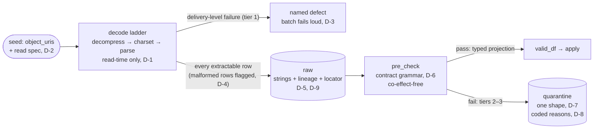

# Admission
## `land` and `pre_check` — Architecture Description (Target)

**Status:** Draft v0.1 · **Parent:** *001 Batch Data Processing Architecture* (§2.2, §5) · **Plan:** 003 §3.2 · **Spine:** 004 §5–§6 (context and stage protocol — normative, unaltered here) · **Position:** stages 1–2 of the sequence; the boundary where a registered delivery becomes rows · **Pattern:** remember (raw) + validate (shape); tolerant reader, strict projection

> **Conventions.** Positions are recorded as decisions **D-1…D-11** in Y-statement form so 006–009 and 012 can cite both the choice and its cost. Every section after the decision record opens with the problem it answers. This doc discharges 004 §16.3 (unreadable rows) and the 005 register of 004.1 §15.2 and the 004.1 errata notes §2; each obligation is cited where it lands. Detail that belongs to the LLD (005.1) or another cluster doc is named and deferred, not sketched here.

---

## 1. Context — From a Registered Delivery to Rows

**The problem.** Ingestion ends with three artifacts: immutable objects in the landing prefix, a ledger row, and a `delivery-registered` event (002 §1). The spine defines what a stage *is* and what the context accretes (004 §5–§6), and runs today on a deliberately provisional reader: CSV, UTF-8, FAILFAST — any malformed byte kills the whole batch (004.1 I-P1), and `pre_check` is a null-check on declared columns (I-P2). Nothing yet says what a raw row *is*, what "verbatim" can honestly mean after gunzip and charset decoding, what happens to the one row in ten million that won't parse, or what the quarantine table looks like — and 012's remediation workflow will be built on that table's shape. This document answers those questions.

Admission is two stages with one job each: **`land` remembers** — every extractable row of the delivery, decoded under a declared read spec, stamped with lineage and a locator back to its exact source bytes; **`pre_check` validates shape** — is each row an instance of the declared raw contract — and routes failures to quarantine as data, never as effects. Interpretation happens here and only here: upstream never parses (002 §1), downstream receives an admitted, typed dataframe and owns *business* judgment (006).

### 1.1 The shape at a glance



**Legend.** Both tables append-only, stage-guarded per 004 D-4; `land` keeps exactly one table write (D-4 below); quarantine's only admission writer is `pre_check`. Solid claims about bytes live in the landing zone; solid claims about rows live in raw; the function between them is declared data (D-1/D-2).

---

## 2. Scope & Non-Goals

**This doc owns:** the read spec (decode ladder, dialect, failure tiers), the raw table's schema and semantics (the verbatim-as-decoded claim), the raw-contract grammar and `pre_check` mechanics, the quarantine table schema and reasons taxonomy, multi-object attribution (the record locator), and admission grants/classification.

**Deferred:** violation identity for post_check's keyed subtraction and the perception contract (006); dedup, delta detection, ordering keys (007); payload freeze, compaction cadence (008); the authoring file format and freeze of contract/read-spec surfaces (009, with Track A); the remediation workflow itself (012 — this doc designs quarantine *for* it, ahead of it); locator mechanics, corrupt-record capture, canonical serialization (005.1).

---

## 3. Decision Record

**D-1 — Verbatim is the landing object; raw is a declared decoding of it.**
In the context of the raw table's "verbatim" claim (001 §5) surviving decompression and charset decoding, facing the fact that rows do not exist until bytes are interpreted, we chose to locate the byte-level verbatim claim on the write-once landing objects (002 §4.1) and define the raw table as **verbatim-as-decoded**: a deterministic function of (landing objects, read-spec version), applied at read time only, with every raw row carrying a locator to its exact source object and the read-spec version stamped on the batch, and rejected both pretending decoded rows *are* the bytes and materializing "fixed" intermediate objects, to achieve an honest claim at each layer — bytes in landing, rows in raw, both immutable, the function between them declared and versioned — accepting that a defective read spec produces wrong-but-recorded rows whose correction is a correcting entry through the front door (002 §8, 012), never an in-place fix.

**D-2 — One authored home: the read spec lives with the raw contract in the pipeline package.**
In the context of where decode/dialect declarations are authored, facing `format_hints` currently authored in `source.yaml` (002 §5.2) while interpreted exclusively by the stage sequence, we chose a single authored home — the read spec joins the raw contract in the pipeline package, versioned together, because a delimiter change *is* a contract review — and rejected two authored homes for one concern, to achieve zero drift between how rows are decoded and what shape they must have, accepting a recorded 002 erratum (`format_hints` demoted to documentation, removal decided at 009) and a coordination note to Track A. Nothing operational moves: registration never interpreted bytes anyway (002 §1).

**D-3 — Three failure tiers; granularity decides the channel.**
In the context of read and validation failures ranging from a corrupt gzip stream to a null in one cell, facing the pull to handle them all in one mechanism, we chose three tiers: **(1) delivery-level** — an undecodable object, or a header that is not an instance of the contract's required columns — is a named defect that fails the batch loudly; **(2) row-level structural** — a row that won't parse as a record of the declared dialect — quarantines as `unreadable/…`; **(3) row-level content** — a parseable row failing a contract check — quarantines as `contract/…`; and rejected whole-file failure for row trouble (001 §2.2) and rejected synthesizing delivery-level pseudo-rows into quarantine, to achieve quarantine as a strictly row-granular record while delivery-level trouble stays in the channel that already reifies runs (run ledger, alarms, corrected re-send — 002 §8), accepting that delivery-level defects never appear in 012's queue (they ride run-failure alarms) and that a missing-header incident cannot flood quarantine with millions of identical rows.

**D-4 — Malformed rows land in raw, flagged; `pre_check` quarantines them.**
In the context of where tier-2 rows live, facing 004's constraints that `land` performs one table write (004 §8) and that `raw_df` is read back by name from the raw table (004 §5.2) — so anything not written to raw is invisible to `pre_check` — we chose to have the reader capture unparseable rows as flagged raw rows (`malformed_text` non-null, source columns null) so that **every extractable row lands in raw**, with `pre_check` turning flagged rows into quarantine rows, and rejected a second land-stage quarantine write (a new guard key and a change to 004 §8's failure map) and rejected dropping malformed rows from raw, to achieve raw as the complete row-granular record of the delivery with the spine's failure map untouched, accepting flagged junk rows in raw — explained in quarantine, excluded from `valid_df` by construction.

**D-5 — Raw columns are strings; typing is `pre_check`'s output.**
In the context of when types appear, facing the choice between typing at land, at pre_check, or in `apply`, we chose raw stores source-named columns as strings exactly as parsed, and `valid_df` is the **typed projection** cast per the raw contract — where the castability check and the cast are one declared function — and rejected typed raw (interpretation baked into the remember step, with nowhere for a cast failure to go but the whole batch) and rejected leaving typing to `apply` (every pipeline reinventing coercion in code the grammar can't review), to achieve mechanical, declared typing whose failures are ordinary contract quarantine rows, accepting one more in-plan representation between raw and `apply` (plans, not copies — 004 D-2).

**D-6 — `pre_check` is framework code driven by a declarative grammar; co-effect-freedom is load-bearing.**
In the context of 003 §3.2.5's question — framework-driven or pipeline-supplied — facing the rerun-consistency constraint 004.1 hands down (E-5: recomputation on a guard-skipped rerun must agree with durable quarantine rows, which holds only if the predicate is deterministic and co-effect-free), we chose framework-executed checks compiled from the declared raw contract — presence, type/castability, nullability, allowed values, pattern, bounds, declared read-integrity checks — with pipelines contributing **zero admission code**, and rejected pipeline-supplied pre_check rules, and rejected vendor rule engines (Glue Data Quality's DQDL / deequ — 001 §6's mapping, superseded here with a recorded erratum, §13.5), to achieve E-5 by construction and one reviewed grammar instead of N bespoke validators, accepting that the grammar will be asked to grow — and the answer is always a new declared check interpreted by the framework (002 §5.3's rule), while cross-field and referential rules go where co-effects and business judgment already live: `post_check` (006).

The DQDL rejection, on mechanics rather than taste: **(a)** DQDL is a verdict engine — per-rule pass/fail over a dataset, a *gate* — where pre_check is a *router*: every failing row becomes a quarantine fact with a reason while the rest continue (001 §2.2 forbids the gate shape at the root; Glue DQ's failed-record surfacing is bolted onto verdict semantics, not row-routing with errors-as-data). **(b)** It evaluates a frame already parsed and produces no typed projection, so the cast layer stays ours — two evaluators that can disagree, the exact divergence D-5's one-function rule exists to kill. **(c)** Its semantics version on the service's cadence, not in the pipeline package — `check_version` provenance and E-5's recompute-agrees-with-durable-rows argument degrade to "whatever the service did that day" — and its grammar ships co-effectful and dataset-relative rules (anomaly detection, cross-dataset counts) as declarations the purity linter cannot see. **(d)** Managed evaluation doesn't run in CI's local-Spark substrate (004 D-7), and deequ-the-library is a JVM dependency with the same verdict-oriented API. **(e)** Track A wants one authored rule source across both lanes; the event lane cannot evaluate DQDL. Where DQDL/deequ remains welcome: dataset-level quality *observability* over published tables — drift, anomaly dashboards — perception, non-gating (004 §13.4's class), never admission.

**D-7 — One quarantine table per pipeline, one shape for every writer.**
In the context of the quarantine schema, facing 004.1's warning that I-12's rerun-subtract mechanism *fails open* if pre_check's raw-shaped and post_check's fact-shaped rows diverge (errata notes §2 — the Phase-1 identity exemplar worked by coincidence of shapes), we chose a fixed, pipeline-independent schema whose offending payload is one serialized column (`row_snapshot`, canonical JSON) plus `row_hash`, `check_stage`, locator, and reason columns, and rejected shape-of-raw / shape-of-facts quarantine (two shapes, or one that only accidentally coincides), to achieve a single schema every stage writes and 012 reads, valid for arbitrarily reshaping pipelines, with keyed violation identity (`row_hash`) offered to 006 in place of I-12's all-column anti-join, accepting that quarantined payloads are JSON-extraction queries rather than typed columns (remediation views project what they need).

**D-8 — Reasons are governed codes; row values never appear in reason text.**
In the context of the reasons taxonomy, facing free-text convenience against 004.1's [S-9] (reason strings must not embed row values — the table is append-only, indefinitely retained, Athena-queried), we chose namespaced stable codes (`unreadable/…`, `contract/…`, `business/…`) plus bounded machine detail — column name, check id, expected *class*, never cell contents — additive-only, and rejected free-text reasons, to achieve a queryable taxonomy 012 can hang ownership and SLAs on, with reason columns projectable at lower classification than payloads, accepting the small standing discipline that a new failure mode requires a taxonomy addition. The offending value itself lives in `row_snapshot`, which inherits raw's classification.

**D-9 — The record locator: `(source_uri, object_seq, row_index)`, assigned once at land.**
In the context of multi-object deliveries and remediation's need to say "row 1042 of file X," facing Spark's weak native ordering guarantees, we chose every raw row carries a locator — `object_seq` = the object's position in the delivery's lexicographically sorted `object_uris`, `row_index` = the row's ordinal within its object as parsed — assigned at land and durable thereafter, and rejected both cross-object *ordering* claims (arrival layout has no business meaning; ordering lives in fact content, 007) and re-derivable-only locators, to achieve stable attribution for quarantine, audit, and partner conversations — with rerun consistency resting on raw's durability, not on Spark's reproducibility, since the locator is written exactly once under land's guard — accepting that 005.1 must implement per-object row numbering deterministically for that single write.

**D-10 — Admission tables are not published interfaces; grants are stage-scoped; classification is inherited — filenames included.**
In the context of who may touch raw and quarantine, facing the standing pull to let consumers "just peek at raw" (002 §10.6, one hop downstream), we chose raw and quarantine writable only by their stage write paths (append-only, per 004 D-4's guarded commits), raw readable by framework and audit, quarantine readable additionally by the remediation role (012), with `source_uri` and every partner-authored string — filenames included — classified as payload, not metadata (004.1 [S-8]), and rejected publishing raw, to achieve the published-interface rule intact (facts and current state only, 002 §9) and remediation access without over-exposure, accepting more IAM objects — the price the lane already pays per plugin (002 §12).

**D-11 — Declared columns are raw's schema; undeclared content rides an `extras` map.**
In the context of the tolerant reader landing everything a delivery carries, facing the fact that native columns for undeclared fields would let any partner mutate raw's schema at land time — permanent, additive-only DDL driven by delivered file content (five hundred junk columns, the same name in two casings, names Iceberg dislikes), we chose raw's columns are exactly the contract's declared columns (as strings, D-5) plus one `extras: map<string,string>` carrying every undeclared column verbatim, and rejected native-column landing of undeclared content, to achieve accretion without partner-driven DDL — values kept, schema authored — accepting map-extraction queries over `extras` (the same trade D-7 accepted for `row_snapshot`) and a promotion seam: when the contract adopts a column, new rows carry it natively, history keeps it in `extras`, and a view coalesces the two.

---

## 4. Information Model

**The problem.** Before schemas: what are admission's facts, what are its identities, and who perceives what?

**The facts:** "delivery D, decoded under read-spec S@v, yielded these rows" — raw rows, locator-stamped, malformed ones flagged; and "row L failed check C with reason R at stage P" — quarantine rows. Both are values: append-only, never updated, each traceable through `batch_id` to the delivery, objects, and driver run that produced them (002 §8).

**The identities:** the per-pipeline raw and quarantine tables (successions of Iceberg snapshots). The read spec and raw contract are *versioned values* in the pipeline package — the package is the identity, versions are its values; a version is stamped onto what it produced, so "which function made these rows" is a column, not archaeology.

**The perceptions:** `apply` perceives `valid_df` — the typed, admitted projection, and nothing else (001 §5). Remediation (012) perceives quarantine as a fold — queue state derives from quarantine rows plus future remediation facts; there is no status column to update (002 §6's discipline, applied to our own table). Auditors perceive raw + locators + the run ledger. Feed owners perceive reason codes and locators — never another feed's payloads.

---

## 5. The Read Spec

**The problem.** The bytes in landing are compressed, encoded, dialected — and the module that acquired them is forbidden to interpret them (002 §1). Something must declare, not code, how bytes become rows; and every way that can fail needs a named tier (D-3).

### 5.1 Shape (authored in the pipeline package, D-2; file format frozen at 009)

```yaml
read:
  compression: gzip            # ladder step 1: none | gzip | zstd — framework-interpreted
  charset: utf-8               # ladder step 2: decode; see §5.3 for the honesty note
  dialect:                     # ladder step 3: parse
    format: csv                # grammar starts where the feeds are; additive growth (§5.5)
    delimiter: ","
    quote: '"'
    header: true
    multiline: false           # true = declared trade-off, §5.4
  skip_leading_lines: 0        # the 002 §5.3 exemplar, honored here
```

The decode ladder runs at read time only. Nothing intermediate is ever written: no decompressed copies, no "fixed" files — the landing zone is never a working area (002 §4.1), and a materialized intermediate would be an undeclared second source of truth.

### 5.2 Failure tiers (D-3), normatively

| Tier | Example | Channel | Remediation path |
|---|---|---|---|
| **1 — delivery-level** | corrupt gzip; charset yields no decodable stream; header missing a `required` column | Named defect; batch fails loudly. Deterministic — plain exception, never `TransientError` (it burns SFN retries by design, same class as 004.1's binding defects) | Corrected re-send (002 §8) or a read-spec/contract fix; visible via run ledger + failure alarm |
| **2 — row structural** | ragged row; unclosed quote; row that won't parse as a record of the dialect | Flagged into raw (D-4), quarantined by `pre_check` as `unreadable/…` | 012 queue |
| **3 — row content** | cast failure; null in non-nullable; value outside declared domain | Quarantined by `pre_check` as `contract/…` | 012 queue |

A delivery whose *every* row fails tiers 2–3 still completes: zero facts, a completed batch, and a quarantine-rate alarm (004.1 §11.4). Validation routes rows; it never gates the process.

### 5.3 The encoding honesty note

Spark's decoder never raises on invalid input bytes — it substitutes U+FFFD silently (004.1 errata notes §2). Silent substitution is a lie of omission in a table claiming "as decoded," so: the contract grammar includes a declared read-integrity check, `forbid_replacement_chars`, **default on** — rows containing U+FFFD after decode quarantine as `unreadable/encoding-suspect`. A feed whose source legitimately ships U+FFFD declares the opt-out in its contract, reviewed. Named limitation: the check cannot distinguish decoder-produced U+FFFD from source-shipped U+FFFD; the opt-out and the landing-zone originals (replayable under a corrected charset) are the honest answers.

### 5.4 The multiline trade-off

`multiline: false` (default) preserves file splittability and lets an unclosed quote surface as a detectable tier-2 row. `multiline: true` supports RFC-4180 embedded newlines at the cost of both: whole-file parse, and an unclosed quote silently consuming the remainder of the file into one cell. It is a *declared* per-feed trade-off in the read spec, reviewed like a completeness timer (002 §7): the risk is named in the PR, never ambient.

### 5.5 Format growth

CSV first — the two exemplar feeds are CSV. Fixed-width, JSONL, and EBCDIC-transcoded formats are added as **framework readers driven by new declared dialect fields**, never as pipeline code — the moment a read spec grows a field whose value is code, the capability API has been rebuilt through the back door (002 §5.3, verbatim).

---

## 6. The Raw Table

**The problem.** The raw table is the row-granular system of record for everything downstream (001 §3.1) — but it must also stay an honest, auditable function of the landing objects, and carry enough attribution that any row can be traced to its exact source bytes.

### 6.1 Schema (columns normative; types/partitioning harden in 005.1)

| Column group | Columns | Notes |
|---|---|---|
| Lineage | `batch_id`, `delivery_id`, `feed_id`, `received_at` | The `LineageStamp` (004.1 §7.5), stamped by the framework |
| Locator | `source_uri`, `object_seq`, `row_index` | D-9; `source_uri` classified as payload (D-10) |
| Decode provenance | `read_spec_version` | Which declared function produced these rows (D-1's auditability) |
| Structural flag | `malformed_text` | Non-null = tier-2 row: the undecoded line verbatim, source columns null (D-4) |
| Source columns | one string column per **declared** column | Named per contract; **all strings** (D-5) |
| Undeclared content | `extras: map<string,string>` | Every column the delivery carries beyond the contract, verbatim (D-11) — accretion without partner-driven DDL |

**Tolerant reader, strict projection.** Columns the delivery carries beyond the contract are landed — accretion says keep them — but into `extras`, never into raw's schema (D-11): raw's columns are authored by the contract, not by whatever arrived. Undeclared content is likewise **excluded from `valid_df`**: `apply` sees exactly the declared contract, so no pipeline can silently grow a dependency on an undeclared column. When a new column matters, the contract adds it (additive-only, 001 §7): new rows carry it natively, history keeps it in `extras`, and a view coalesces the two.

**Counts reconcile by construction:** `raw_count` (all extractable rows, flagged included — the number `batch-started` carries) = |`valid_df`| + `pre_quarantined_count` — well-defined because quarantine's grain is one row per offending row (§8.1).

### 6.2 Standing properties

- **Append-only, IAM-enforced**, written only by `land`'s guarded single commit (004 D-4); one commit per batch at any volume (004 §8's one-commit invariant applies to raw explicitly).
- **Batch-clustering obligation extends here.** `read_batch(raw_table, batch_id)` runs on every attempt (004 §5.2) and the guard probes it; the compaction-preserves-`batch_id`-clustering obligation 004.1 handed 008 for fact tables ([T-9]) covers raw and quarantine equally — recorded for 008's register.
- **Rebuildability is an audit claim, not an operational path.** Replaying (landing objects, read-spec@v) should reproduce raw's rows; this is what makes D-1 checkable. Operationally raw is never rewritten — a bad decode is corrected by correcting entries (D-1's accepting clause), and the replay claim is exercised as a test, not a runbook.

---

## 7. `pre_check` and the Raw-Contract Grammar

**The problem.** I-P2's null-check must become a real contract — expressive enough for shape, mechanically executable, and structurally incapable of drifting into business logic or co-effects (the E-5 constraint that makes rerun-consistency free).

### 7.1 The grammar (semantics normative here; authoring file format frozen at 009 with Track A)

Per column: `name`, `type` (string | int | long | decimal(p,s) | date(fmt) | timestamp(fmt) | bool), `required` (header must contain it — a **tier-1** check), `nullable` (cell may be null — tier-3), `allowed_values`, `pattern`, `min`/`max`. Per contract: `forbid_replacement_chars` (default on, §5.3).

| Check | Tier | Reason family |
|---|---|---|
| header contains every `required` column | 1 — defect | — (fails the batch, D-3) |
| row parses as a record of the dialect | 2 | `unreadable/malformed-row` |
| post-decode U+FFFD scan (unless opted out) | 2 | `unreadable/encoding-suspect` |
| castability to declared `type` | 3 | `contract/cast-failure` |
| `nullable: false` | 3 | `contract/null-violation` |
| `allowed_values` | 3 | `contract/value-not-allowed` |
| `pattern` | 3 | `contract/pattern-mismatch` |
| `min` / `max` | 3 | `contract/out-of-bounds` |

**Distinguish `required` from `nullable`.** `required` is a claim about the *header* — its violation means the file is not an instance of the contract, tier 1, no row flood (D-3). `nullable` is a claim about *cells* — row-granular, tier 3.

**The contract is a land-time input too.** The `required` header check runs when the reader first binds the file — at `land`, before any append — so the grammar is not pre_check-only. This is drift-safe because contract and read spec are co-versioned in one package (D-2) and both are framework inputs. In a multi-object delivery, any single object failing the header check is a tier-1 defect for the **whole batch**: delivery granularity admits no partial admission (§9).

### 7.2 Mechanics

- **One evaluation, two outputs.** `valid_df` and the violation set derive from a single evaluation of the compiled predicate over durable raw — the same-predicate rule 004.1 §7.5 already states, kept normative. The castability check and the cast are **one function**: a row admitted is a row that cast; there is no second cast that can disagree.
- **The typed projection.** `valid_df` = declared columns only, cast to declared types, flagged and violating rows removed. This is 001 §5's `raw_df`-argument-to-`apply`, post-admission (004.1 §7.5's note, now grounded).
- **Co-effect-freedom is law, not style.** The compiled predicate reads durable raw and the versioned contract — nothing else. The moment a proposed check wants a lookup (a reference table, current state, another feed), it has become a business rule and belongs in `post_check` with declared co-effects (006). This is what keeps E-5's rerun-consistency argument true by construction rather than by review vigilance.
- **Cross-field checks** (e.g., `end_date ≥ start_date`) are deterministic and co-effect-free, but the Phase-1 grammar stays per-column; cross-field row checks go to `post_check` until the grammar grows a declared form for them — a named growth path, not a gap.
- **Idempotency and the guard-skip path.** Guarded append keyed `(batch_id, "pre_check")`; zero violations ⇒ no write, naturally idempotent (004 §8). But determinism over durable raw is **not sufficient** for rerun consistency: the predicate is a function of (durable raw, contract@version), and the contract version is not pinned across attempts of one batch — I-23 pins artifacts by content, but the deployed pin can move between attempts (an SFN retry after a redeploy; an operator `--rN` days later). A kill between pre_check's append and commit, a contract change, and a restart would otherwise feed `apply` a `valid_df` the durable quarantine rows contradict — complementarity breaking silently. So on a guard-skipped rerun **the durable rows are authoritative**: `valid_df` is derived by read-back subtraction — raw rows minus the durable quarantine locators for `(batch_id, "pre_check")` — the post_check idiom (004.1 I-12) applied one stage earlier, available here without 006's open identity question because every pre_check quarantine row carries a non-null unique locator (D-9). The recomputed predicate still runs, as a **probe**: recomputed-vs-durable mismatch, and any subtracted-set row failing the *current* cast, are recorded as data — WARNING, metric, ledger `error_message` — never raised, never silently dropped (counts ride the ledger row). §6.1's count identity is asserted on the fresh-compute path only, mirroring [H-2]. Residual, named: the typed cast runs under the current contract, so a mid-batch contract change surfaces as recorded drift, not as pinning — the detection-not-pinning posture 004 §8 takes for unpinned co-effects, extended to admission (the 004.1 §15.3 note-6 shape).

---

## 8. Quarantine

**The problem.** Quarantine is written by two stages with different row shapes, read by a remediation workflow that doesn't exist yet (012), retained indefinitely, and load-bearing for the spine's rerun mechanics (I-12). Its schema is therefore a contract with three futures — 006's violation identity, 008's maintenance, 012's queue — and it must be designed for them now, cheaply, rather than migrated later, expensively.

### 8.1 Schema (one shape for every writer — D-7)

| Column group | Columns | Notes |
|---|---|---|
| Lineage | `batch_id`, `delivery_id`, `feed_id` | Guard key component 1 |
| Stage | `check_stage` (`pre_check` \| `post_check`) | Guard key component 2 (004 §8's two-writer note) |
| Locator | `source_uri`, `object_seq`, `row_index` | Non-null on pre_check rows; nullable on post_check rows (a candidate fact may derive from many raw rows — attribution semantics owned by 006) |
| Domain identity | `domain_id`, `record_key` | Nullable; populated on post_check rows where known |
| Violation identity | `row_hash` | Hash of canonical `row_snapshot` — offered to 006 as the keyed-subtraction identity replacing I-12's all-column anti-join |
| Reason | `reason_code`, `reason_detail` | Codes per §8.2; detail is bounded machine context — column name, check id, expected class — **never cell values** (D-8, [S-9]) |
| Provenance | `check_version`, `quarantined_at` | Which contract/rule version rejected the row |
| Payload | `row_snapshot` | Canonical JSON of the offending row (pre) or candidate fact (post); the one column carrying data values; classification inherited from raw (D-10) |

**Grain: one quarantine row per offending row** (per offending candidate fact at post_check), never per failed check. A row failing several checks yields one row: `reason_code` = the first failure in declared evaluation order (the §7.1 table's order, then contract column order), `reason_detail` = the full failed-check set — still bounded machine context, never cell values (D-8). This keeps §6.1's count identity, the quarantine-rate alarm, and 012's queue counts trivially well-defined, while remediation keeps the whole failure set for its second round trip (fix the null, re-send, discover the cast failure — the set was known the whole time). Per-check rows were rejected: they complect "how many rows are bad" with "how many ways they are bad," and every count downstream inherits the confusion.

**`row_hash` is value-identity, not occurrence-identity.** Two identical offending values produce indistinguishable rows (same hash; at post_check, null locators). Hash-keyed subtraction is sound iff violations are value-determined — true for row-wise pure checks, false for occurrence- or dataset-relative ones. Recorded as a precondition 006 must hold when it takes up violation identity (§13.2).

**Why one serialized shape dissolves the I-12 precondition.** The rerun-subtract path reads durable quarantine rows back and treats them as the violation set; that is only sound if pre- and post-shaped rows live in one projection. Shaping the payload as a serialized value makes the table's shape *independent of any pipeline's columns* — the identity exemplar's byte-identical-projection coincidence (004.1 errata notes §2) becomes a property that holds for every reshaping pipeline, by construction.

### 8.2 Reasons taxonomy (governed, additive-only — D-8)

Initial codes: `unreadable/malformed-row`, `unreadable/encoding-suspect`, `contract/cast-failure`, `contract/null-violation`, `contract/value-not-allowed`, `contract/pattern-mismatch`, `contract/out-of-bounds`. The `business/…` namespace is reserved for `post_check`: codes are authored in the pipeline package (they are business vocabulary), governed with the contracts (Track A), and structurally identical rows — 006 owns their semantics. Codes are never reused or renamed; retirement is additive (a code stops being emitted; history keeps its meaning).

### 8.3 Designed for 012, ahead of it

- **Queue state is a fold.** "Open quarantine items for feed X" is a fold over quarantine rows plus future remediation facts (acknowledged, re-delivered, compensated, waived — each a new fact). The table grows **no status column**; dispositions accrete (002 §6's ledger discipline applied to our own table).
- **Ownership and SLA hooks.** Per-feed ownership lives in a registry 012 owns; `feed_id` + `quarantined_at` are the join keys and SLA clock. The per-pipeline quarantine-rate alarm (004.1 §11.4) is the interim escalation path until 012's queue exists.
- **The remediation invariant, restated for this table** (003 §7): remediation produces new deliveries or new facts — never edits to quarantine, raw, or fact rows. Fixed data re-enters through the front door.

### 8.4 Grants and classification (D-10)

Append-only writes from the stage write path only. Reads: framework, audit, and the remediation role. `row_snapshot` and `source_uri` carry the raw table's data classification ([S-8]: partner-authored filenames are payload); reason and lineage columns are projectable at lower classification, which is what lets a remediation *queue view* be broadly visible while payloads stay scoped.

---

## 9. Multi-Object Deliveries and the Record Locator

**The problem.** One delivery may comprise many objects (002 §6: `object_uris` is an array), but the sequence runs once per batch. What is the relationship between objects, rows, and order?

- **One delivery → one raw batch.** All rows from all data objects land under one `batch_id` in one commit. Completeness was asserted upstream (002 §7); admission never sees a partial delivery — and symmetrically, any single object failing the tier-1 header check defects the whole batch (§7.1): there is no partial admission of a delivery.
- **Data objects only.** Manifests are registration metadata (`manifest_ref` in the ledger); they never become rows.
- **Attribution, not order.** `object_seq` (position in the lexicographically sorted `object_uris`) and `row_index` (ordinal within the object) exist so every row, valid or quarantined, can be pointed at — for audit and for the partner conversation "row 1042 of file X." They carry **no business meaning**: ordering that matters to state lives in fact content and is 007's (004 §7.3). Nothing downstream may sort by locator and call it time.
- **The seed spill path ([T-5]), flagged not solved.** When a delivery's `object_uris` outgrows the argv budget, the seed event carries a manifest URI instead — pass by name; the value's name replaces the value (004 D-3's idiom, applied to the seed). This is an additive event-contract change coordinated with 002.1 and 004.1; recorded as an open item with both docs named (§13).

---

## 10. Failure & Idempotency — Admission's Rows of the Map

**The problem.** 004 §8 owns the restart story; admission must slot into it without adding a rule.

| Stage | Effect | Guard | Refinements from this doc |
|---|---|---|---|
| land | one guarded append to raw (flagged rows included) + `batch-started` | raw has `batch_id`? | Tier-1 defects raise **before** the append — deterministic, plain exception, burning retries loudly by design (§5.2). The reader replaces I-P1's FAILFAST: structural failures are captured per-row (D-4), not thrown |
| pre_check | one guarded append to quarantine | quarantine has (`batch_id`, `pre_check`)? | Fresh path: one evaluation, two outputs (§7.2). Guard-skip path: `valid_df` by read-back subtraction of durable quarantine locators — durable rows authoritative, recompute demoted to a drift probe, recorded never raised (§7.2) |

Nothing else changes: restart is from the top, guards make reruns no-ops, and the healthy-rerun ledger signature (`skipped-guard`, zero appended) reads identically for admission stages.

---

## 11. What to Defend Against

**The problem.** Admission's erosion vectors are the oldest ones in data engineering — every one of them is a reasonable-sounding favor.

1. **"Fix the file in place"** — an operator re-uploading a corrected object over the original. Blocked by bucket policy (002 §4.1); the correct move is a corrected re-send: new delivery, new batch, supersession recorded.
2. **Interpretation creeping upstream** — a driver "just stripping the BOM," a plugin pre-splitting a file. 002 §10.1's linter and template defenses stand; the read spec exists precisely so ugliness is declared here, once, tested.
3. **Typed raw** — "store the amount as decimal, it's cleaner." That bakes interpretation into the remember step and leaves a cast failure nowhere to go but the whole batch. Raw is strings; types are pre_check's output (D-5).
4. **Quarantine growing a `status` column** — the table going place-oriented the moment remediation starts. Dispositions accrete as facts; queue state is a fold (§8.3).
5. **Reason text embedding cell values** — a classification leak into the table's most-queried columns, irreversible in an append-only table ([S-9], D-8).
6. **The grammar growing a code-valued field** — "just let us pass a predicate." That is `pre_check` becoming pipeline code through the back door, and E-5's rerun argument dies with it (D-6; 002 §5.3).
7. **Raw becoming a published interface** — "analysts just want to peek." One hop downstream of 002 §10.6, same answer: published interfaces are facts and current state (D-10).
8. **Locator misread as order** — sorting by `(object_seq, row_index)` and calling it event time. Attribution is not ordering; ordering is fact content (007, D-9).
9. **Delivery-level pseudo-rows in quarantine** — complecting granularities to get header failures "into the queue." Tier-1 trouble rides the run channel (D-3); giving it a fake row identity poisons every count 012 relies on.

---

## 12. Trade-offs, Named

| Chosen | Given up | Why it's fine |
|---|---|---|
| Verbatim-as-decoded (D-1) | "Raw *is* the source" simplicity | The claim was never true post-gzip; two honest layers (bytes / rows) with a declared function between beats one false one |
| Read spec in the pipeline package (D-2) | `format_hints` co-located with acquisition config | Decode and contract must move together; a 002 erratum is cheaper than permanent drift between two authored homes |
| Tier-1 defect for header/undecodable trouble (D-3) | Those failures visible in 012's queue | They're visible where runs already are (ledger + alarms); quarantine stays row-granular and flood-proof |
| Flagged malformed rows in raw (D-4) | A "clean" raw table | Raw's job is completeness, not cleanliness; the flag plus quarantine explains every row, and the spine's failure map is untouched |
| Undeclared columns in an `extras` map (D-11) | Native-column queryability of undeclared content | Raw's schema is authored by the contract, not by whatever arrives; values are kept, and promotion is additive with a coalescing view |
| Durable-rows-authoritative rerun at pre_check (§7.2) | Attempt-level recompute purity as the whole story | The contract version is a co-input the deploy pin can move between attempts; subtraction closes the complementarity window, and drift is detected as data — the lane's standing posture |
| Framework grammar, zero pipeline admission code (D-6) | Pipeline flexibility at pre_check | Flexibility is available one stage later with co-effects declared; grammar requests queue on the platform — a review-shaped bottleneck, deliberately (002 §12) |
| One serialized quarantine shape (D-7) | Typed queryability of quarantined payloads | JSON extraction is a query-side cost; a shape-diverging quarantine silently breaks I-12's rerun mechanics — correctness beats convenience |
| Strict encoding check by default (§5.3) | Clean runs for feeds that ship U+FFFD | Those feeds opt out *in a reviewed contract*; the default refuses silent mojibake |
| `multiline: false` default (§5.4) | Embedded-newline support out of the box | The feed that needs it declares it and accepts the named parse-integrity cost — per-feed, reviewed, never ambient |
| Locator assigned once at land (D-9) | Cross-read reproducibility of row numbering | The write happens once under a guard; durability, not determinism, carries reruns |

---

## 13. Open Items

1. **Authoring file format and home** for the raw contract + read spec (one file or two, schema format) → 009, needing Track A's provisional answer (003 §4).
2. **Violation identity** — whether `row_hash` alone keys the post_check subtraction, and the perception/attribution semantics of post_check quarantine rows → 006 (columns provided here, §8.1). Precondition recorded: hash-keyed subtraction assumes violations are value-determined (§8.1); an occurrence- or dataset-relative check breaks it.
3. **LLD mechanics** → 005.1: corrupt-record capture under the chosen reader; deterministic per-object `row_index`; canonical JSON serialization for `row_snapshot` and the `row_hash` algorithm (coordinate with 007's fact-hash canonicalization idiom — shared property-test vectors per 004 D-13, not shared code); the serialization must handle both snapshot structures under `unreadable/…` (malformed rows carry `malformed_text` with null source columns; encoding-suspect rows carry parsed columns) and decide whether the U+FFFD scan applies to `malformed_text` itself; raw/quarantine partitioning and table properties.
4. **Seed spill path** — manifest-URI indirection for oversized `object_uris`; additive change to the event contract, coordinated with 002.1 (producer) and 004.1 (consumer) ([T-5], §9).
5. **Parent-doc errata** — **002**: `format_hints` demoted to documentation in `source.yaml`; removal decided at 009 (D-2). **001 §6**: the quality-rules service mapping ("Glue Data Quality / deequ") is superseded for `pre_check` by D-6's grammar; DQDL/deequ remain available as non-gating observability over published tables, never as the admission gate.
6. **008 register additions + the erasure gap** — compaction must preserve `batch_id` clustering on raw and quarantine, not only facts ([T-9] extension, §6.2). Quarantine retention is decided **with `conveyer-4ot.41`** (PII/CMK/erasure — structural at the first real pipeline, 004.1 §15.2/Track B), not as a bare retention length: quarantine, `malformed_text`, and `extras` concentrate exactly the un-contracted payload nobody promised to receive — the mis-uploaded file, the mis-keyed sensitive column — indefinitely retained with no crypto-shred path today. "Indefinite, same as facts" is the default only until that bead rules.
7. **Taxonomy governance and queue substrate** → 012 / Track C (§8.2–8.3); `business/…` code authoring surface → 009.
8. **New format readers** (fixed-width, JSONL, EBCDIC) — added as declared dialect growth when a resident feed needs them (§5.5); each is a framework reader, never a redesign.

---

## 14. Related Documents

- **001** — parent; §2.2 (quarantine, never whole-file failure), §5 (stage table) are normative inputs; receives D-6's erratum to §6 (quality-rules mapping, §13.5).
- **002 / 002.1** — upstream module: landing-zone immutability (§4.1), `format_hints` and the data-not-callbacks rule (§5.2–5.3), supersession (§8), access rules (§9); receives D-2's erratum.
- **004 / 004.1** — the spine: context and protocol (§5–§6, normative), failure map (§8), the admission obligations register (004.1 §15.2, errata notes §2) discharged here.
- **006** — receives `valid_df`'s contract, the pre/post boundary, `row_hash`, and post_check attribution semantics.
- **007** — ordering and fact-hash canonicalization (locator is not order, §9).
- **008** — maintenance obligations extended to admission tables (§6.2).
- **009** — freezes the authoring surfaces previewed here (§5.1, §7.1).
- **012** — the remediation workflow quarantine is designed for (§8.3).
