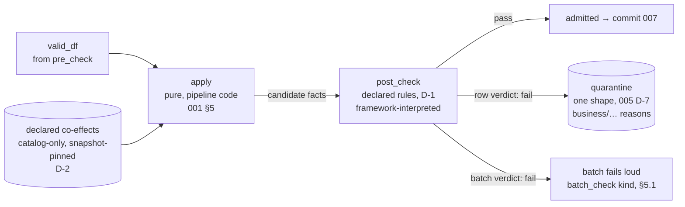

# Pure Core
## `pull`, `apply`, `post_check` — Architecture Description (Draft)

**Status:** Draft v0.5 — D-1–D-5 settled (design discussions, 2026-08-03–06); everything else is a drafted problem statement with its option space, held in §6 until settled · **Parent:** *001 Batch Data Processing Architecture* (§3.5, §5) · **Plan:** 003 §3.3 · **Spine:** 004 v1.1 / 004.1 v0.3 + errata notes (stage protocol, context accretion, guard/append mechanics — normative, unaltered here) · **Admission:** 005 v1.0 / 005.1 v0.3 (`valid_df` contract, quarantine one-shape, `row_hash`, the A-14 interim pair this doc rules on) · **Siblings:** 007 (co-drafted seam — candidate-fact columns), 008, 009 (authoring-surface freeze), 012 · **Position:** stages 3–5 of the sequence; the boundary where admitted rows become candidate facts · **Pattern:** transform as pure code; judgment as declared data; co-effects declared, never buried

> **Conventions.** Positions are recorded as decisions **D-n** in Y-statement form (005's convention) so 007–009 and 012 can cite both the choice and its cost. v0.1 contains one settled decision (D-1) and an explicit work list (§6); a section drafted here is not binding until this doc reaches v1.0. Every section after the decision record opens with the problem it answers. This doc receives the registers of 004 §7.3, 004.1 §15.2, 005 §13.2, 005.1 §15.2, and errata-notes §2; each received obligation is recorded in §3 and cited where it lands.

---

## 1. Context — From `valid_df` to Candidate Facts

**The problem.** Admission ends with a typed, admitted dataframe (`valid_df`) and a quarantine table that is complementary to it by construction (005 §7.2). The spine defines the stage protocol and what the context accretes (004 §5–§6). Nothing yet says how a pipeline declares what else it needs to see (`pull`), what shape candidate facts have before commit stamps lineage (`apply`), or how business judgment is expressed and its violations routed (`post_check`). Meanwhile the implementation runs on interim mechanics this doc must ratify or replace: a pure-code `post_check` returning a `violations_df` (candidate columns + `reason`, multiplicity-preserving subset [C-8]), a path-split subtraction (fresh: all-column bag-subtract; rerun: `row_hash`-keyed), and the fact-presence demotion door at both admission-adjacent writers ([DC-1]/[R2-1]).

The pure core is where the pipeline *computes* (003 §1): the framework owns every effect; the pipeline contributes pure functions and declarations. This doc decides the shape of those declarations.

### 1.1 The shape at a glance

**Legend.** `apply` is the only pipeline-authored *code* in the lane; `post_check` is pipeline-authored *data*. Judgment routes rows or fails the batch — it never gates rows silently and never performs effects. Quarantine's post_check writer produces 005 §8.1's exact columns.

---

## 2. Scope & Non-Goals

**In scope:** co-effect declaration grammar and snapshot semantics; the `own_state` flagged kind and the perception contract; `apply`'s signature and the candidate-fact contract (columns co-drafted with 007); the `post_check` declared surface (D-1) and its check kinds; violation identity and post_check attribution; the authoring-surface preview 009 freezes.

**Deferred:** fact canonicalization, dedup on `(batch_id, record_key, content_hash)`, delta detection, the fold contract and ordering keys (007); `batch-completed` payload and maintenance (008); the authored file format and freeze (009, with Track A); remediation workflow (012); `serialize` honoring mechanics — designed when the first `own_state` pipeline appears (004 §7.3).

---

## 3. Received Obligations (recorded, per the handing docs' instruction)

| From | Obligation | Lands |
|---|---|---|
| 004 §7.3 | `own_state` is a distinct, *flagged* co-effect kind — self-reference must be visible in the declaration; it activates the `serialize` question | D-2 (flag in grammar), D-3 (bind refusal + coupling rule) |
| 004 §7.3 | State the perception contract `apply` may assume: the folds of all batches *completed* before this batch's `pull`; nothing about concurrent siblings unless serialized | D-3 (recast as the floor clause of the snapshot-based contract) |
| 004.1 §15.2 | Violation identity for keyed subtraction, replacing I-12's all-column anti-join and its count assertion; co-effect declaration grammar with `own_state` (the model field exists, default `False`); perception contract wording | §5.4, D-2, D-3 |
| 005 §13.2 / §8.1 | Whether `row_hash` alone keys the post_check subtraction; **precondition recorded: hash-keyed subtraction is sound iff violations are value-determined** — occurrence- or dataset-relative checks break it | D-1, §5.4 |
| 005 §7.2 | Cross-field checks remain post_check's until the grammar grows a declared form | §5.1 |
| 005 §8.2 / Track A | `business/…` codes are business vocabulary, authored in the pipeline package, governed with the contracts; structurally identical rows — 006 owns their semantics | §5.1, §5.3 |
| 005.1 §15.2 (A-14) | The interim pair to ratify or replace: reason grammar `^business/[a-z0-9][a-z0-9-]*$` at the violations seam; path-split subtraction (fresh: bag-subtract [DC-5], rerun: `row_hash`-keyed); the fact-presence demotion door at post_check [R2-1] | §5.4 |
| 005.1 §15.2 | post_check attribution semantics: `record_key` on post rows, locators-on-post-rows (nullable — a candidate fact may derive from many raw rows) | §6.1 (producer settled by D-4) |
| impl. register (conveyer-azr) | Hash subtraction is not multiplicity-preserving for occurrence-relative checks — the exact precondition this doc rules on; `checks.zero_failures()` is the sanctioned fresh-path filter seam (`typed_projection`'s failures column is private) | D-1, §5.4 |
| 003 §5 item A | Cross-lane contract governance needs a **provisional** answer here (one authored source for taxonomy and rules); full design with the Event Model doc's owners | §5.3 |

---

## 4. Decision Record

### D-1 — `post_check` is a declared surface: rules as data, framework-interpreted, zero pipeline check code — **settled**

In the context of `post_check`'s authoring surface (003 §3.3.3), facing the value-determinism precondition (005 §8.1) that no linter can enforce on arbitrary code — purity is syntactically visible, occurrence-relativity is not: a pure function using `row_number()`, `groupBy`, or `count` passes every AST check and breaks hash-keyed rerun subtraction silently — and facing Track A's requirement of one authored rule source across two lanes of which one cannot execute PySpark, **we chose declared checks interpreted by the framework** — row-expression checks over an allowlisted expression subset, membership checks against declared co-effects, and `batch_check` as a distinct batch-verdict kind — with pipelines contributing zero check code, **and rejected** pipeline-supplied pure-code checks, **and rejected** a flagged code escape hatch now (adding a declared code-check kind later is additive; removing a frozen code surface later is breaking — and culturally the hatch is one-way: once "just write code" exists, grammar growth stops being requested), **to achieve** rerun-sound violation identity by construction (the grammar cannot express the counterexample), one rule source both lanes interpret, and the same E-5-class argument 005 D-5 won for pre_check extended to business judgment, **accepting that** an inexpressible rule waits on grammar growth via a framework release rather than ten lines of pipeline code — mitigated by check interpreters being small and mechanically similar (005 §7.1's growth rule: the answer is always a new declared check kind), but real, and accepted with eyes open.

**What D-1 ratifies in one move** (the A-14 register discharges): `row_hash`-keyed rerun subtraction becomes *sound by construction*, not by precondition; the `business/…` reason grammar stops being a seam assertion and becomes a declared field the framework emits; the fresh path keeps `violation_subtraction`'s bag-subtract [DC-5] (both sets candidate-shaped in memory; multiplicity semantics preserved — and multiplicity of value-identical candidates is already meaningless one stage later, since 007 dedups on content hash); the [R2-1] fact-presence door is unchanged by this decision and ratifies as-is. Details in §5.4.

**Falsifier before v1.0:** inventory the real commission-statements rules (carrier-x feed, 003 §4). The decision predicts zero code checks needed: negative amount and cross-field arithmetic are row expressions, unknown-agent is a membership check, control totals are `batch_check`. If the inventory surfaces a rule none of the three kinds can express, the escape-hatch rejection is revisited *here*, before 009 freezes anything.

**Falsifier sample run (2026-08-06, external retail-pipeline plan as proxy inventory):** every rule in a conventional medallion DQ ruleset mapped without code checks — most land in 005's contract grammar (nulls, casts, enums, bounds, patterns), FK checks are **membership**, cross-field arithmetic is **row**, and the one occurrence-relative rule (duplicate-business-key survivor logic) dissolves entirely: value-identical dupes collapse at 007's dedup, same-key-different-content rows become facts ordered by the fold — the survivor is chosen deterministically and the loser is *retained*, not quarantined. One growth candidate found, no counterexample: conditioned membership (row valid per a co-effect row's date range — promo-validity class) needs `membership` to grow a declared predicate against co-effect columns; still value-determined, so D-1's soundness is untouched (§5.1 note). `batch_check` was unexercised by the sample; carrier feedback subsequently supplied its first real customer — detail/summary member reconciliation (D-5) — closing the untested-kind gap. The full carrier-x rule inventory remains the binding falsifier for completeness.

### D-2 — Co-effects: catalog-only references, alias → table + `own_state` + optional columns, snapshot-pinned at `pull` — **settled**

In the context of the co-effect declaration grammar and snapshot semantics (003 §3.3.1), facing S-15 (grants derived from declarations), D-1's membership checks (which reference co-effect columns), and the standing temptation to admit "just one lookup" against an external system, **we chose**: a declaration binds a **local alias** to an Iceberg-catalog table reference, the `own_state` flag (004 §7.3 — self-reference visible in the declaration), and an **optional `columns:` list**; **references resolve within the catalog only** — an external source in a co-effect declaration is a bind-time defect; at `pull`, every declared co-effect resolves to a **pinned snapshot id** before any read, the framework reads `VERSION AS OF`, and the ids accrete into the context and fold to the ledger — **and rejected** table-only granularity (loses column-scoped grants and the bind-time coherence check that membership-check references ⊆ declared columns), **and rejected** a declared `filter:` (a filter is a transform and transforms live in `apply` or a declared check; Catalyst prunes from the plan regardless, so the declaration buys no I/O — it would buy only a second allowlist-governed expression surface), **and rejected** external/JDBC co-effects (an operational database is a place, not a value: nothing to pin ⇒ reproducible perception dies; rerun drift becomes invisible with no durable-authoritative fallback — the E-5-class argument; and the batch's availability complects with the external system's), **to achieve** reproducible, batch-coherent perception as *recorded data* (any attempt's reads reconstructible via time travel), least-privilege grants as IaC outputs, and an honest column-grain dependency surface, **accepting that** external reference data must be ingested as a feed (or the event lane's materialization) and its freshness is bounded by that feed's cadence — someone operates the feed; that per-table snapshot resolution admits a metadata-window cross-table skew (no cross-table transaction exists to buy; the skew is recorded, hence perceptible — reproducibility over simultaneity); and that an over-declared `columns:` list is a small lie policed only in the under-declared direction.

**Mechanics settled with it:**

- **`apply` perceives values, not places**: `co_effects` is a mapping *alias → dataframe pinned to the recorded snapshot id*. Nothing else crosses the seam. Repointing a physical table touches the declaration, never transform code — global names for global identities, local names in the package.
- **Fold-boundary coherence for free**: an Iceberg snapshot of a current-state table is always a committed-fold boundary (folds are single atomic MERGEs), so per-table batch coherence comes from pinning itself — no `batch-completed` gating on the pull path.
- **Rerun**: `pull` re-resolves *current* snapshots; drift is data (004 §8's detection-not-pinning posture — cited, not re-decided; this doc has no authority over spine mechanics).
- **Bind-time checks**: declared table exists in the catalog; declared columns exist in its schema; every membership-check column reference ⊆ its co-effect's declared columns (when declared); `own_state: true` must reference the pipeline's own current-state table; duplicate aliases rejected.
- **The external-data rule, stated as flow**: external systems enter conveyer through ingestion (or the event lane) — landing → facts → fold — and the *resulting current-state table* is what a co-effect may name. This is 002's "upstream never parses" applied to `pull`: you never perceive an external system, you perceive the fold of its ingested facts. Corollary: reference data is time-travelable like everything else — "which roster did batch N see" is a ledger lookup plus `VERSION AS OF`.
- **Growth, additive**: if a table ever becomes economically prohibitive to scan whole (cost, not overload — S3 has no connection pool to exhaust), a declared `filter:` field arrives *then*, with a real customer and §5.2's allowlist discipline, per the D-1 posture on speculative surface.

### D-3 — The perception contract is snapshot-based; `own_state: true` is a bind-time defect until honoring exists — **settled**

In the context of wording the perception contract (004 §7.3's handed obligation) and deciding what binding does with `own_state: true` before any honoring mechanics exist, facing the gap between 004's sentence — "the folds of all batches completed before this batch's `pull`" — and what `apply` actually perceives (pinned snapshots, D-2), **we chose** a snapshot-based contract of four clauses (below) in which 004's sentence survives as the *floor* guarantee it always was, with `serialize: true` closing the ceiling for the pipeline's own state only; **and chose** bind-time refusal of `own_state: true` — a named defect citing the 004 §7.3 deferral — with the coupling rule (`own_state: true` requires `serialize: true`) stated now and enforced when the refusal lifts, **and rejected** publishing 004's wording verbatim (a floor mistaken for a description: it neither owns that folded-but-unpublished batches are visible nor that concurrent siblings may be), **and rejected** accept-and-record (grants provisioned, serialized clause footnoted "not yet enforced" — a guarantee published before its mechanism, the vigilance posture D-1 and D-2 each rejected), **and rejected** building the honoring mechanics now (004 §7.3's explicit deferral stands; zero own-state pipelines exist), **to achieve** a contract `apply` authors can reason from without knowing spine internals, and a deferral that is structural — the unsupported state is unrepresentable in a bound pipeline rather than documented around — **accepting that** the first own-state pipeline pays a design-task latency (the SQS FIFO / semaphore decision) before it can bind.

**The perception contract (normative):**

1. **Exactness.** For each declared co-effect, `apply` perceives exactly the value of the snapshot pinned at this batch's `pull` — no more, no less; an attempt's perception never changes underneath it.
2. **Batch-coherence, by construction.** Every conveyer table's stage writers commit atomically per (batch, stage) — fold is one MERGE, commit is one append — so a pinned snapshot never exposes a partial batch. Corollary: the "wait for `batch-completed`" discipline binds *event-driven* consumers of current state; snapshot-pinned co-effects need no gate, because a pinned snapshot has no mid-batch time to see.
3. **Completed-fold floor, no ceiling.** The snapshot of a current-state table contains *at least* the folds of every batch of that pipeline completed before resolution (fold-commit precedes `batch-completed`). It may also contain folds of batches that committed but have not published, including concurrent siblings — `apply` may not assume their absence. Under `serialize: true`, the ceiling closes for the pipeline's *own* state only: no sibling runs, so the own-state snapshot reflects all prior folds of this pipeline and nothing mid-flight. That is serialization's entire effect on the contract.
4. **No freshness.** Resolution time promises nothing about business time — a snapshot faithfully reflects a feed that is three days late. Recency is a property of facts (ordering keys, 007), never of perception.

### D-4 — Candidate facts: per-type typed frames against declared fact schemas; identity and ordering declared, framework-derived; `apply` perceives declared columns only — **settled** (co-drafted seam; 007 ratifies the consuming semantics)

In the context of `apply`'s signature and the candidate-fact contract (003 §3.3.2), facing 007's need for `domain_id`, `record_key`, and ordering columns as consumable surfaces ([H-6], [T-11], [T-12]), and facing [S-8]'s classification of partner filenames as payload while facts are published interfaces, **we chose**: `apply(valid_df, co_effects) → {fact_type: candidate_df}` — one pure function per pipeline returning one frame per **declared fact type**, each conforming to a **declared fact schema** in the package, each landing in its own fact table (a new fact type is a new table — additive, per the standing evolution rule); identity and ordering enter by **declaration**: the fact schema names `domain_id_col`, `record_key: [cols]`, and `ordering: [cols]` — `apply` populates columns, the framework derives `record_key` canonically (007's vectors) and validates the declaration at bind (columns exist, ordering types comparable, [H-6]'s state-DDL columns generated from the declaration, mechanically); and `apply` perceives the **declared contract columns of `valid_df` only** — never admission's lineage columns — **and rejected** one mixed `facts_df` (a `fact_type` column over a union-struct or blob payload complects heterogeneous relations into one and forfeits typed query leverage — the reason fact tables beat a file system), **and rejected** apply-computed identity/ordering by convention (identity semantics are *why*, and why lives in declarations the framework interprets — D-1's rule; 007 would otherwise consume an unverifiable convention), **and rejected** lineage visibility in `apply` (mechanics complected into business code — and a classification escalation: `source_uri` is payload-classified, facts are published; filename-borne business data must enter as a *declared* read-spec mapping with its classification decided at declaration time — registered to 005 v1.x/009), **to achieve** a candidate seam that is a typed, declared contract on both sides — admission validates inbound rows against the raw contract, the core's outbound rows validate against the fact contract — with `apply`'s obligation shrunk to what only business code can do, **accepting that** multi-type ceremony costs single-type pipelines a one-entry mapping (~zero), and that a feed whose business time rides in its filename waits on the declared mapping before it can be built.

**Mechanics settled with it:**

- **Return-shape law**: the mapping's keys must equal the declared fact-type set — missing or extra keys are bind/runtime defects; an empty frame for a declared type is valid (a delivery may yield no facts of a type).
- **Defects vs. data, at this seam**: a candidate frame failing its declared schema (shape, types, non-null `domain_id_col`… as declared) is an **author bug — loud defect**, never quarantine. Quarantine is for what the *data* did; defects are for what the *code* did. Business judgment over well-shaped candidates belongs to D-1's declared checks.
- **Commit's stamps, restated for the seam**: `batch_id`, lineage/attribution, `received_at`, and the derived `content_hash` are commit's; canonicalization excludes the stamps (007) — facts stay batch-independent, which is what makes delta detection mean anything.
- **NULL `domain_id`**: the *decision* stays 007's registered question (I-24 fail-fast vs. quarantine), but the *mechanism* is named here: if 007 chooses quarantine, it is a framework-authored implicit check at this seam routing `business/missing-domain-id`-class rows as data — no new machinery.
- **Handed to 007 (register)**: the declared surfaces — `record_key: [cols]` (dedup key participant), `ordering: [cols]` ([H-6]/[T-11] — 007 pins the comparison semantics; this doc only guarantees the columns exist, typed and declared), `domain_id_col` ([T-12]'s cardinality subject) — plus canonical `record_key` derivation joining `content_hash` under the shared-vectors discipline (§5.3's idiom).

### D-5 — `batch_check` control values come from a declared sibling delivery member's admitted rows; delivery composition is admission's, absence detection is registration's — **settled** (carrier feedback, 2026-08-06)

In the context of `batch_check`'s control-value sourcing (§6's formerly open item), facing real feed feedback — commission feeds deliver a **detail** member and a **summary** member in one delivery, and a missing member fails the whole batch — **we chose**: `batch_check` control values may reference the **admitted rows of a declared sibling member of the same batch** (the summary-member class): the aggregate expression over the detail member's candidates compares against the summary member's admitted values — batch verdict, fail loud, no row quarantine, per §5.1; **delivery composition itself is admission's ground**, registered upstream (§7): declared members (name, match pattern, per-member read spec and raw contract, `required` flag) and a tier-1 defect (`missing-required-member` class — delivery-level failure, the gate shape 005 D-3 already permits); **absence detection is registration's ground**, registered to 002.1: *absence is not an event* — "the summary never came" is perceivable only against a declared pairing rule and deadline, so ingestion owns the timer and admission's tier-1 is the structural backstop when a partial delivery registers anyway — **and rejected** sourcing this class from a co-effect table (the control value is batch-local data that arrived *with* the batch; a co-effect read would complect this batch's verdict with another table's cadence and another pipeline's schedule), **and rejected** trailer-records-within-one-file now (no resident customer; future growth through the normal rule), **to achieve** reconciliation as a declared, value-determined batch verdict over data that arrived together and is validated together — closing the falsifier's untested kind with a real rule class — **accepting that** two-member feeds cannot be built until 005's member grammar lands, and that the summary member's own admission (its read spec, contract, and quarantine behavior) precedes any `batch_check` evaluation — stage order already guarantees this; the exactly-one-summary-row expectation and control-extraction mechanics are LLD grain, named for 006.1/009.

*(Further decisions — attribution, the 009 authoring preview — are open; §6 states each problem. They enter this record as D-6… as they settle.)*

---

## 5. `post_check` — The Declared Surface (D-1, drafted)

**The problem.** Business judgment must route rows to quarantine with governed reasons, or fail a batch loudly — while remaining rerun-consistent under the spine's guard/subtraction mechanics, evaluable by the event lane, and authorable by pipeline teams (and agents) without framework review of logic.

### 5.1 Check kinds

Three declared kinds at v0.1 — deliberately few; growth is a new kind, never an escape to code (005 §7.1's rule applied one stage later):

| Kind | Form (sketch — file format is 009's) | Verdict | Value-determined because |
|---|---|---|---|
| **row** | `expr` over the candidate row's columns, allowlisted subset (§5.2); `reason: business/…` | per-row → quarantine | verdict is a function of the row value alone |
| **membership** | column(s) must exist in a declared co-effect's column(s); `reason: business/…` | per-row → quarantine | verdict is a function of (row value, co-effect snapshot value) — deterministic within an attempt; cross-attempt co-effect drift is already handled by the durable-authoritative rerun path + drift-as-data ([H-2]) |
| **batch_check** | aggregate `expr` over the candidate set compared against a declared control value sourced from a sibling delivery member's admitted rows (D-5 — summary-member class) | per-batch → batch fails loud, no quarantine rows | attribution to rows is arbitrary by construction, so none is attempted — the aggregate is the verdict |

Cross-field row rules (`net = gross − fees`) are row expressions — 005 §7.2's "until the grammar grows a declared form" is discharged by the **row** kind. Occurrence-relative rules (duplicate detection, "first occurrence wins") are *inexpressible* — deliberately: value-identical candidates collapse at 007's dedup anyway; a duplicate-quarantine check would do 007's job early with broken rerun semantics.

**Named growth candidate (falsifier sample run, D-1):** conditioned membership — the row is valid iff a matching co-effect row exists *and* a declared predicate over that row's columns holds (`order_ts between promo.start_date and promo.end_date` — the promo-validity class). Existence-on-equality membership cannot express it; the growth is a declared `where:` clause on the membership kind, evaluated against the co-effect's columns under §5.2's allowlist. Value-determined (row value + co-effect snapshot), so hash-keyed identity is unthreatened. Arrives through the normal growth rule when a resident pipeline needs it — recorded here so it is a design already named, not a surprise.

### 5.2 The expression subset — an allowlist, not "whatever Spark SQL accepts"

If `expr` is raw Spark SQL, D-1's hole returns through the back door: `rand()`, `current_timestamp()`, window functions, scalar subqueries — all inside one string the linter already treats as a sink. Bind-time validation against a **pinned function allowlist**: deterministic scalar functions and operators only; no aggregates (outside `batch_check`'s aggregate position), no windows, no subqueries, no non-deterministic functions. The allowlist is versioned with the framework and CI-pinned the way `try_cast` semantics are (005 §15-erratum 3). A rejected expression is a bind-time defect — deterministic, loud, pre-land class (004.1 §9).

### 5.3 One rule source, two interpreters (Track A — the provisional answer)

Rules are data in the pipeline package; the batch lane compiles them to Spark expressions, the event lane to its own runtime. The trap is semantic divergence — SQL vs. Mongo null semantics, decimal comparison, string collation. Posture: **shared vectors, never shared code** (004 D-13, the canonical-JSON idiom applied to rule semantics) — committed fixture files of `(rule, input row, verdict)` triples both interpreters must pass. This is the provisional answer 003 §5-A requires; the full design (taxonomy governance, authoring format, ownership) lands with the Event Model doc's owners and 009.

### 5.4 Subtraction and identity — the A-14 pair, ratified

- **Fresh path:** `admitted = candidate` bag-subtracted against the in-memory violations via `frames/checks.py::violation_subtraction`, count identity asserted — unchanged [DC-5]. `checks.zero_failures()` remains the sanctioned filter seam.
- **Guard-present rerun:** recompute candidates, hash (005.1 §7.3), anti-join the durable `row_hash` set for `(batch_id, "post_check")` — now sound *by construction*: every expressible check is value-determined, so verdicts on value-identical rows are identical and hash subtraction preserves multiplicity semantics for every check that can exist.
- **Fact-presence door [R2-1]:** unchanged — facts present + no guard row ⇒ durable state authoritative, empty violation set, no append, recompute demoted to the `post_check_drift` probe.
- **The count assertion** (I-12) stays fresh-path-only ([H-2]'s demotion unchanged).

The 005 §8.1 precondition is hereby *ruled on*: it holds not as a documented assumption but because the surface cannot violate it. If a future declared kind is ever proposed whose verdicts are not value-determined, this section is the tripwire: it must be rejected or must carry its own identity mechanism as part of its design.

---

## 6. Work List — Open Positions (option spaces, not decisions)

1. **post_check attribution** (005.1 §15.2): with `record_key`'s producer now settled (D-4 — framework-derived from the declared columns), post_check quarantine rows can plausibly carry it whenever the candidate row's declared `record_key` columns are populated; locators stay nullable on post rows (a candidate fact may derive from many raw rows — attribution is by `domain_id`/`record_key`, not locator). Mostly drafting; settle after 007 ratifies the declared surfaces.
2. **Authoring-surface preview for 009**: file layout of declared checks, co-effect declarations, fact schemas (D-4), and member references (D-5) in the pipeline package (yaml alongside `pipeline.yaml` vs. inside it); versioning (`check_version` already accretes in context, 004.1 §15.3-5).

---

## 7. Register Handed Downstream (record in the receiving doc's decision record)

- **005 v1.x / 009 — delivery-member composition** (D-5): the read-spec grammar grows declared members — name, match pattern, per-member read spec and raw contract, `required` flag — with tier-1 defect `missing-required-member` (delivery-level, D-3's existing gate shape) and member-scoped raw handling for heterogeneous schemas. First customer: the commission detail/summary pair. `required` is per-member, per-feed: a zero-activity period may make detail legitimately optional (absent optional member ⇒ zero rows ⇒ the batch_check reconciles 0 against the summary total — a nonzero total then fails loudly, the summary-claims-what-detail-lacks case caught for free). **Coherence rule (bind-time, D-2/D-4's class): a member referenced as a `batch_check` control source must be `required: true`** — a declared check that cannot evaluate must be an inexpressible spec, never a silent skip.
- **005 v1.x / 009 — filename-borne business data** (D-4): a declared admission mapping projecting filename-derived values into contract columns, with its classification decided at declaration time ([S-8]: partner filenames are payload). A feed whose business time rides only in its filename waits on this.
- **002.1 — pairing rule and member-grain expectations** (D-5): the absence machinery already exists (002 §2 job 5 — `delivery-overdue` from the expectation schedule; 002.1's overdue-marker CAS) — the growth is **member grain**: expectations and pairing must understand a delivery as a declared member set, so "summary arrived, detail didn't, deadline passed" is an expressible overdue condition, and registration decides whether a partial pair waits or registers (and lets admission's tier-1 kill it). Interaction with supersession when a corrected member arrives late.
- **007 — the D-4 surfaces** (restated from D-4's mechanics block): `record_key: [cols]`, `ordering: [cols]`, `domain_id_col`, canonical `record_key` derivation under shared vectors, and the NULL-`domain_id` mechanism option.
- **009 / Track A** — the declared-rule authoring format and cross-lane vector governance (§5.3's provisional answer made full).
- **006.1** — the LLD grain named throughout: bind-time validator inventory (D-2, D-4), control-extraction mechanics and the exactly-one-summary-row expectation (D-5), the expression-subset allowlist's concrete function list (§5.2).

## 8. Trade-offs, Named (D-1–D-5)

- **Grammar-growth latency** (D-1). The first inexpressible rule waits on a framework release. Accepted; mitigated by the smallness of check interpreters and by §4's falsifier having been run against the first real pipeline before freeze.
- **Two interpreters to keep honest** (D-1). Cross-lane vectors are a standing maintenance surface — the cost of one rule source. The alternative (forked rule definitions) was rejected as the larger permanent cost.
- **An allowlist to govern** (D-1). Every allowlist addition is a semantics decision (deterministic? portable to the event lane?) — deliberate friction, same class as 005's contract-grammar growth.
- **Reference-data latency and a feed to operate** (D-2). Catalog-only co-effects mean external reference data arrives at feed cadence, not lookup time, and someone owns that feed. This is the batch lane's founding trade re-paid at `pull` — taken knowingly, once, instead of leaking one JDBC lookup at a time.
- **Cross-table skew, recorded not removed** (D-2). Per-table snapshot resolution admits a metadata-window skew between co-effects; buying simultaneity would cost cross-table coordination nobody needs. The recorded snapshot ids make the skew perceptible after the fact, which is the property that actually matters.
- **A locked door instead of a documented hazard** (D-3). Refusing `own_state: true` at bind means the first own-state pipeline waits on the serialize-honoring design before it can even bind — a real latency, priced against the alternative of a published guarantee with no mechanism behind it.
- **A declaration surface that can lie slightly** (D-4). Declared fact schemas, `record_key`, and `ordering` are one more authored surface that can drift from intent; bind-time validation polices existence and coherence, not meaning. Accepted — the alternative put the same meaning in code where nothing polices it at all.
- **Filename-borne business data waits** (D-4). A feed whose business period rides only in its filename cannot be built until the declared admission mapping exists (005 v1.x/009) — deliberate: the alternative was payload-classified strings flowing into published facts through an undeclared hole.
- **Two-member feeds wait on upstream grammar** (D-5). The detail/summary feed cannot build until 005's member composition lands — the cost of putting composition where validation lives instead of special-casing it in the core. The reconciliation rule itself was free: `batch_check` existed before its first customer arrived.

---

## 9. Related Documents

**001** §3.5/§5 (context accretion; pure core) · **003** §3.3 (this doc's charter), §5-A · **004 v1.1 / 004.1 v0.3 + errata notes** — stage protocol, `own_state` field, I-12's history, [H-2]/[H-6]/[C-8] · **005 v1.0** — D-5 (the pre_check precedent D-1 extends), §7.2, §8.1–8.3, §13.2 · **005.1 v0.3** — §8.2 (the interim pair), §15.2-006 · **007** — co-drafted candidate-fact seam; receives D-4's declared surfaces (`record_key`, `ordering`, `domain_id_col`) and the NULL-`domain_id` mechanism option · **009** — freezes the authored surface · **012 / Tracks A–C** — reason taxonomy governance, remediation.
